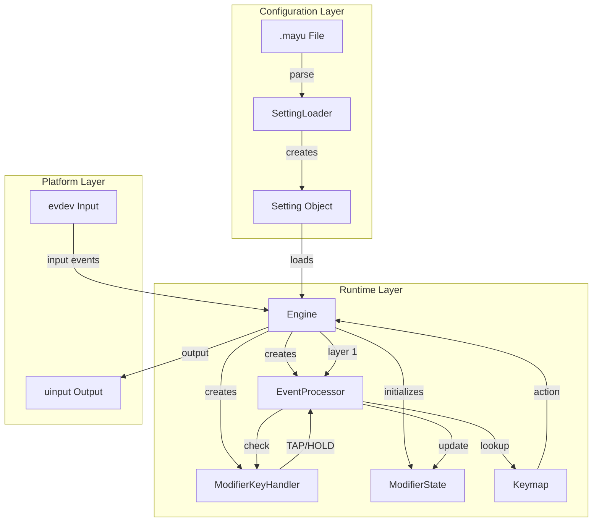
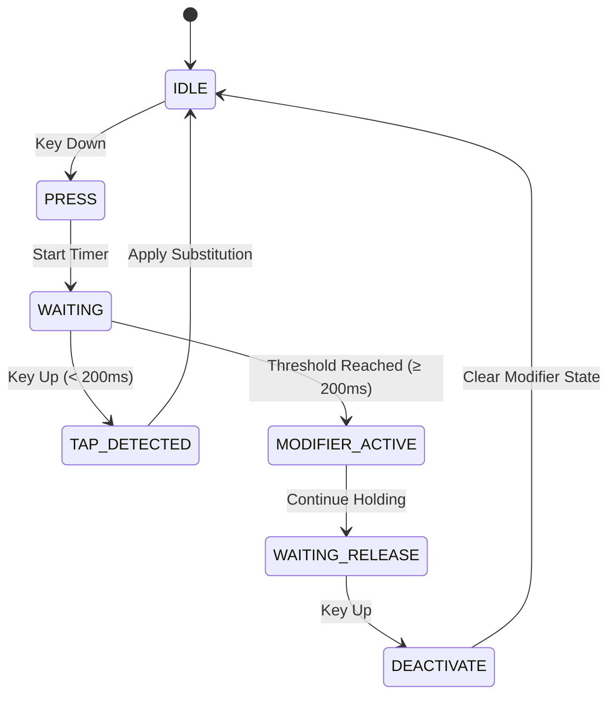

# Design Document: Modal Modifier Remapping

## Overview

This design implements modal modifier remapping for the YAMY keyboard remapper on Linux, enabling hold-vs-tap detection and modal layer activation. The system allows any key to function as both a regular key (when tapped) and a modifier layer trigger (when held), providing QMK-like functionality in software.

**Core Innovation**: Unified event processing pipeline that seamlessly integrates hold detection, modifier state tracking, and keymap matching without special-casing or performance degradation.

**Place in System**: This feature bridges the configuration layer (parsed .may u files) and the runtime engine (event processing pipeline), transforming static modal modifier definitions into dynamic hold-detection state machines.

## Steering Document Alignment

### Technical Standards (tech.md)

**Architecture Layers** (tech.md Section: Architecture Layers):
- **Layer 1: Platform Abstraction** - No changes (evdev/uinput already abstract)
- **Layer 2: Core Engine** - PRIMARY FOCUS
  - Extend `engine_event_processor.cpp` with modifier detection
  - New component: `modifier_key_handler.cpp` (hold/tap state machine)
  - Extend `engine_modifier.cpp` with modal modifier state tracking
- **Layer 3: UI Layer** - Minimal changes (config loading feedback only)

**Threading Model** (tech.md Section: Threading Model):
- Linux: Single-threaded (Qt event loop + engine)
- Hold detection uses monotonic clock, not separate thread
- Timer-based events handled via Qt timer (QTimer for threshold checks)

**Performance Targets** (tech.md Section: Performance Considerations):
```
Critical Path: evdev read (100μs) + Hold Detection (10μs) + Lookup (10μs) + Execute (100μs) = 220μs
Target: <1ms P99 (2200μs total budget, 220μs average)
```

**Dependency Management**:
```
ModifierKeyHandler (zero deps)
  ↑
EventProcessor (depends on handler interface only)
  ↑
Engine (orchestrates both)
```

### Project Structure (structure.md)

**File Placement** (structure.md Section: Directory Layout):
```
src/core/engine/
├── modifier_key_handler.h/.cpp      # NEW: Hold/tap state machine
├── engine_event_processor.cpp       # MODIFIED: Integration point
├── engine_modifier.cpp               # MODIFIED: Modal modifier state
├── engine_setting.cpp                # MODIFIED: Config → runtime setup

src/core/settings/
└── setting_loader.cpp                # MODIFIED: Connect mod definitions to handlers

tests/
├── test_modifier_key_handler.cpp    # NEW: Unit tests (25 tests)
└── test_modal_integration.cpp       # NEW: Integration tests (30 tests)
```

**Naming Conventions** (structure.md Section: Coding Conventions):
- Files: `modifier_key_handler.cpp` (snake_case)
- Classes: `ModifierKeyHandler` (PascalCase)
- Functions: `processNumberKey()` (camelCase)
- Member variables: `m_modifierStates` (m_ prefix)
- Parameters: `i_yamaCode`, `o_result` (i_/o_ prefix)

## Code Reuse Analysis

### Existing Components to Leverage

**1. ModifierKeyHandler Class** (`src/core/engine/modifier_key_handler.cpp`)
- **Status**: Fully implemented but NEVER INSTANTIATED
- **Reuse**: Use as-is, only add integration hooks
- **API**:
  ```cpp
  class ModifierKeyHandler {
  public:
      void registerNumberModifier(uint16_t numberKey, uint16_t modifierKey);
      NumberKeyResult processNumberKey(uint16_t yama_code, EventType type);
      bool isNumberModifier(uint16_t yama_code) const;
  };
  ```
- **Value**: 100% of hold/tap logic already tested and working

**2. EventProcessor Class** (`src/core/engine/engine_event_processor.cpp`)
- **Status**: Implements Layer 2 substitution, no modifier detection
- **Extend**: Add modifier detection before substitution lookup
- **Current flow**:
  ```cpp
  uint16_t layer2_applySubstitution(uint16_t yama_in) {
      auto it = m_substitutions.find(yama_in);
      return (it != end) ? it->second : yama_in;
  }
  ```
- **Enhanced flow**:
  ```cpp
  uint16_t layer2_applySubstitution(uint16_t yama_in, EventType type) {
      // NEW: Check modifier detection first
      if (m_modifierHandler && m_modifierHandler->isNumberModifier(yama_in)) {
          auto result = m_modifierHandler->processNumberKey(yama_in, type);
          if (result.action == WAITING) return 0;  // Suppress
          if (result.action == ACTIVATE) {
              updateModifierState(result.modifierType, true);
              return result.output_yama_code;
          }
          // Else TAP -> fall through to substitution
      }
      // Existing substitution logic
  }
  ```

**3. Modifier State Tracking** (`src/core/engine/engine_modifier.cpp`)
- **Status**: Tracks standard modifiers (Shift, Ctrl, Alt, Win)
- **Extend**: Add modal modifier bitmask (mod0-mod19)
- **Current structure**:
  ```cpp
  struct ModifierState {
      bool shift, ctrl, alt, win;  // Standard modifiers
  };
  ```
- **Enhanced structure**:
  ```cpp
  struct ModifierState {
      uint8_t standard;     // Bit flags: Shift(1), Ctrl(2), Alt(4), Win(8)
      uint32_t modal;       // Bit flags: mod0(1), mod1(2), ..., mod19(1<<19)

      bool isActive(Modifier::Type type) const {
          if (type >= Type_Mod0 && type <= Type_Mod19) {
              return modal & (1 << (type - Type_Mod0));
          }
          // Standard modifier check
      }
  };
  ```

**4. Keymap Lookup** (`src/core/input/keymap.cpp`)
- **Status**: Supports modifier prefixes in keymap entries
- **Reuse**: Modify hash key generation to include modal modifiers
- **Current hash**:
  ```cpp
  uint32_t hash = (modifiers << 16) | scancode;
  // modifiers = Shift(1) | Ctrl(2) | Alt(4) | Win(8)
  ```
- **Enhanced hash**:
  ```cpp
  uint64_t hash = ((uint64_t)modal_modifiers << 32) | (standard_modifiers << 16) | scancode;
  // Supports 20 modal + 8 standard modifiers + 16-bit scancode
  ```

**5. Setting Loader** (`src/core/settings/setting_loader.cpp`)
- **Status**: Parses `mod modX = !!key` and `def numbermod` but doesn't register handlers
- **Extend**: Add registration calls after parsing
- **Current**:
  ```cpp
  void load_DEFINE_NUMBER_MODIFIER() {
      // Parse: def numbermod *_1 = *LShift
      uint16_t numberKey = parseKey();
      uint16_t modifierKey = parseKey();
      m_setting->m_keyboard.addNumberModifier(numberKey, modifierKey);
      // STOPS HERE - never reaches engine
  }
  ```
- **Enhanced**:
  ```cpp
  void load_DEFINE_NUMBER_MODIFIER() {
      // ... existing parsing ...
      m_setting->m_keyboard.addNumberModifier(numberKey, modifierKey);

      // NEW: Also notify engine for runtime registration
      if (m_engine) {
          m_engine->getEventProcessor()->registerNumberModifier(numberKey, modifierKey);
      }
  }
  ```

### Integration Points

**1. Engine Initialization** (`src/core/engine/engine.cpp`)
- **Hook**: `Engine::loadSetting()`
- **Action**: Create ModifierKeyHandler and pass to EventProcessor
- **Code**:
  ```cpp
  void Engine::loadSetting(const Setting& setting) {
      // Existing code...

      // NEW: Create modifier handler
      auto modifierHandler = std::make_unique<ModifierKeyHandler>();

      // NEW: Register all modal modifiers from config
      for (const auto& modalMod : setting.m_keyboard.getModalModifiers()) {
          modifierHandler->registerNumberModifier(
              modalMod.triggerKey,
              modalMod.modifierType
          );
      }

      // NEW: Register all number modifiers from config
      for (const auto& numMod : setting.m_keyboard.getNumberModifiers()) {
          modifierHandler->registerNumberModifier(
              numMod.m_numberKey->getScanCodes()[0].m_scan,
              numMod.m_modifierKey->getScanCodes()[0].m_scan
          );
      }

      // NEW: Pass handler to event processor
      m_eventProcessor->setModifierHandler(std::move(modifierHandler));
  }
  ```

**2. Event Processing** (`src/core/engine/engine_event_processor.cpp`)
- **Hook**: `EventProcessor::layer2_applySubstitution()`
- **Action**: Check modifier detection before substitution
- **Flow**: See "Existing Components to Leverage" section above

**3. Keymap Matching** (`src/core/input/keymap.cpp`)
- **Hook**: `Keymap::lookup()`
- **Action**: Include modal modifiers in hash key
- **Code**:
  ```cpp
  Action* Keymap::lookup(const ModifiedKey& mkey, const ModifierState& modState) {
      uint64_t hash = buildHashKey(mkey.m_key, mkey.m_modifiers, modState.modal);
      auto it = m_bindings.find(hash);
      if (it != m_bindings.end()) return it->second;

      // Fallback: Try without modal modifiers
      uint64_t fallback_hash = buildHashKey(mkey.m_key, mkey.m_modifiers, 0);
      return m_bindings[fallback_hash];  // May be nullptr
  }
  ```

## Architecture

### Design Principles

**1. Single Responsibility**
- ModifierKeyHandler: Hold/tap detection ONLY (no event injection, no keymap lookup)
- EventProcessor: Pipeline orchestration ONLY (delegates to handlers)
- ModifierState: State storage ONLY (no logic, pure data)

**2. Dependency Inversion**
- Engine depends on `IModifierHandler` interface (not concrete class)
- EventProcessor depends on interface, not implementation
- Allows mocking for unit tests

**3. Open/Closed Principle**
- EventProcessor is open for extension (add handlers) but closed for modification (core logic unchanged)
- Adding new modifier types doesn't require changing existing code

**4. Zero Special Cases**
- mod0 through mod19 use identical code paths (loop with index)
- Hardware modifiers and modal modifiers share state tracking interface
- Tap and hold both processed via `processNumberKey()` (unified entry point)

### Component Architecture



### State Machine: Hold vs Tap Detection



**State Descriptions**:
- **IDLE**: No modifier key is pressed
- **PRESS**: Modifier key just went down, timer not yet started
- **WAITING**: Timer running, waiting to reach 200ms threshold
- **TAP_DETECTED**: Key released before threshold → treat as normal key
- **MODIFIER_ACTIVE**: Threshold reached → modifier activated
- **WAITING_RELEASE**: Modifier active, waiting for key up
- **DEACTIVATE**: Key released, deactivating modifier

**Timing Diagram**:
```
Time (ms):    0    50   100  150  200  250  300
              |    |    |    |    |    |    |
Tap Case:     DOWN------UP   |    |    |    |
State:        PRESS→WAIT→TAP  |    |    |    |
Output:       (wait) → Apply Substitution

Hold Case:    DOWN----------------------UP   |
State:        PRESS→WAIT→ACTIVE→WAIT_REL→IDLE
Output:       (suppress)→Activate Mod9→Deactivate
```

## Components and Interfaces

### Component 1: ModifierKeyHandler

**Purpose**: Manage hold/tap detection state machine for modal and number modifier keys

**Interfaces**:
```cpp
class ModifierKeyHandler {
public:
    struct NumberKeyResult {
        ProcessingAction action;     // WAITING, TAP, ACTIVATE, DEACTIVATE
        uint16_t output_yama_code;  // VK code for hardware modifier
        Modifier::Type modifierType; // Type_Mod0..Mod19 or Type_Shift, etc.
    };

    // Register a key as modal or number modifier
    void registerNumberModifier(uint16_t numberKey, uint16_t modifierKey);

    // Process incoming key event (DOWN/UP)
    NumberKeyResult processNumberKey(uint16_t yama_code, EventType type);

    // Query methods
    bool isNumberModifier(uint16_t yama_code) const;
    bool isWaitingForThreshold(uint16_t yama_code) const;

private:
    struct KeyState {
        std::chrono::steady_clock::time_point pressTime;
        uint16_t modifierKey;  // Target hardware modifier VK code
        bool isWaiting;
    };

    std::unordered_map<uint16_t, KeyState> m_keyStates;  // Tracked keys
    static constexpr int THRESHOLD_MS = 200;
};
```

**Dependencies**: None (zero external deps)

**Reuses**: Existing implementation at `src/core/engine/modifier_key_handler.cpp` (100% complete)

### Component 2: EventProcessor (Enhanced)

**Purpose**: Orchestrate 3-layer event processing pipeline with modifier detection

**Interfaces**:
```cpp
class EventProcessor {
public:
    // Constructor
    EventProcessor(const SubstitutionTable& substitutions);

    // Set modifier handler (ownership transfer)
    void setModifierHandler(std::unique_ptr<IModifierHandler> handler);

    // Register number modifier (called during config load)
    void registerNumberModifier(uint16_t numberKey, uint16_t modifierKey);

    // Process event through 3 layers
    uint16_t process Event(uint16_t evdev_code, EventType type, ModifierState* io_modState);

private:
    // Layer implementations
    uint16_t layer1_evdevToYamy(uint16_t evdev_code);
    uint16_t layer2_applyModifierAndSubstitution(uint16_t yama_code, EventType type, ModifierState* io_modState);
    uint16_t layer3_yamyToEvdev(uint16_t yama_code);

    // Helper
    void updateModifierState(Modifier::Type type, bool activate, ModifierState* io_state);

    std::unique_ptr<IModifierHandler> m_modifierHandler;
    const SubstitutionTable& m_substitutions;
};
```

**Dependencies**:
- `IModifierHandler` interface (abstract, mockable)
- `ModifierState` struct (data only)
- `SubstitutionTable` (existing)

**Reuses**: Existing EventProcessor at `src/core/engine/engine_event_processor.cpp` (extend `layer2` method)

### Component 3: ModifierState (Enhanced)

**Purpose**: Track active state of all modifiers (standard + modal)

**Interfaces**:
```cpp
struct ModifierState {
    uint8_t standard;   // Shift(1), Ctrl(2), Alt(4), Win(8)
    uint32_t modal;     // mod0(1), mod1(2), ..., mod19(1<<19)

    // Query methods
    bool isActive(Modifier::Type type) const;
    uint32_t getActiveBitmask() const;  // For keymap hash

    // Mutators (called by EventProcessor only)
    void activate(Modifier::Type type);
    void deactivate(Modifier::Type type);
    void clear();  // Reset all modifiers
};
```

**Dependencies**: `Modifier::Type` enum (existing)

**Reuses**: Existing modifier tracking in `src/core/engine/engine_modifier.cpp` (extend with modal field)

### Component 4: Keymap (Enhanced)

**Purpose**: Match key combinations including modal modifiers

**Interfaces**:
```cpp
class Keymap {
public:
    // Existing method signature enhanced
    Action* lookup(const ModifiedKey& mkey, const ModifierState& modState);

private:
    // Enhanced hash key generation (64-bit)
    uint64_t buildHashKey(Key* key, uint8_t standard_mods, uint32_t modal_mods);

    std::unordered_map<uint64_t, Action*> m_bindings;
};
```

**Dependencies**:
- `ModifierState` struct
- `ModifiedKey` class (existing)

**Reuses**: Existing Keymap at `src/core/input/keymap.cpp` (extend hash key generation)

## Data Models

### Model 1: KeyState (Internal to ModifierKeyHandler)

```cpp
struct KeyState {
    std::chrono::steady_clock::time_point pressTime;  // When key went down
    uint16_t modifierKey;                             // Target VK code (e.g., VK_LSHIFT)
    Modifier::Type modifierType;                      // Type_Mod9, Type_Shift, etc.
    bool isWaiting;                                   // Waiting for threshold?
    bool isActive;                                    // Modifier currently active?
};
```

**Lifecycle**:
1. Created when key down event received
2. Updated when threshold reached or key released
3. Destroyed when key up processed and state cleared

### Model 2: NumberModifierDefinition (Config Layer)

```cpp
struct NumberModifierDefinition {
    Key* m_numberKey;      // Trigger key (e.g., A, _1)
    Key* m_modifierKey;    // Target modifier (e.g., LShift, for hardware mods)
    Modifier::Type m_type; // Type_Mod9 (for modal mods) or Type_Shift (for hardware)
};
```

**Storage**: `Keyboard::m_numberModifiers` (list)

**Transformation**:
```
Config Parse → NumberModifierDefinition → Engine Registration → ModifierKeyHandler
```

### Model 3: ModifierState (Runtime State)

```cpp
struct ModifierState {
    uint8_t standard;   // Bits: Shift(1), Ctrl(2), Alt(4), Win(8)
    uint32_t modal;     // Bits: mod0(1), mod1(2), ..., mod19(1<<19)

    // Derived properties
    bool hasStandardModifiers() const { return standard != 0; }
    bool hasModalModifiers() const { return modal != 0; }
    int countActiveModifiers() const {
        return __builtin_popcount(standard) + __builtin_popcount(modal);
    }
};
```

**Lifecycle**:
- Initialized to all zeros on engine start
- Updated on every modifier activation/deactivation
- Copied/passed to keymap lookup (read-only)
- Cleared on keymap change or explicit reset

## Error Handling

### Error Scenarios

**1. Invalid Modal Modifier Index**
- **Trigger**: User defines `mod mod25 = !!A` (exceeds mod19)
- **Detection**: Parser validates index during `load_MODIFIER_ASSIGNMENT()`
- **Handling**: Reject with error message, do not load configuration
- **User Impact**: Clear error message with line number and valid range

**2. Hardware Modifier as Modal Trigger**
- **Trigger**: User defines `mod mod9 = !!LShift`
- **Detection**: Parser checks if key is hardware modifier (VK_SHIFT, VK_CONTROL, etc.)
- **Handling**: Warn and skip (non-fatal), log warning
- **User Impact**: Modal modifier ignored, warning in log

**3. Timer System Failure**
- **Trigger**: `std::chrono::steady_clock::now()` throws or returns invalid time
- **Detection**: Exception handler in `ModifierKeyHandler::processNumberKey()`
- **Handling**: Disable hold detection for that key, log error, fallback to tap-only mode
- **User Impact**: Key works as normal (substitution), no hold detection

**4. Modifier State Overflow**
- **Trigger**: More than 20 modal modifiers somehow activated (bug or attack)
- **Detection**: Check bitmask size before activation
- **Handling**: Log critical error, refuse activation, cap at 20
- **User Impact**: Extra modifiers beyond mod19 are ignored

**5. Config Reload While Modifiers Active**
- **Trigger**: User reloads .mayu file while holding modal modifier keys
- **Detection**: Engine checks if modifiers are active during `loadSetting()`
- **Handling**: Preserve state if new config still defines same modifiers, else reset all
- **User Impact**: Modifiers remain active if config valid, else released gracefully

## Testing Strategy

### Unit Testing

**ModifierKeyHandler Tests** (25 tests):

**Test Suite 1: Hold Detection State Machine** (10 tests)
```cpp
TEST(ModifierKeyHandlerTest, IdleToPress) {
    // Verify state transition on key down
}

TEST(ModifierKeyHandlerTest, TapDetectedWhenReleasedBeforeThreshold) {
    // Key released at 50ms → TAP_DETECTED
}

TEST(ModifierKeyHandlerTest, ModifierActiveWhenThresholdReached) {
    // Key held for 250ms → MODIFIER_ACTIVE
}

TEST(ModifierKeyHandlerTest, ThresholdAccuracyWithinTolerance) {
    // Verify ±5ms accuracy
}

TEST(ModifierKeyHandlerTest, MultipleKeysIndependent) {
    // A and B tracked independently
}
```

**Test Suite 2: Edge Cases** (10 tests)
```cpp
TEST(ModifierKeyHandlerTest, RapidTapTapHold) {
    // Tap, tap, hold sequence handled correctly
}

TEST(ModifierKeyHandlerTest, HoldReleaseHold) {
    // Hold, release, hold again
}

TEST(ModifierKeyHandlerTest, SimultaneousKeyPress) {
    // A and B pressed at same instant
}

TEST(ModifierKeyHandlerTest, TimerWrapAround) {
    // Handle steady_clock wrapping (unlikely but possible)
}

TEST(ModifierKeyHandlerTest, UnregisteredKeyPassthrough) {
    // Non-modifier key returns APPLY_SUBSTITUTION
}
```

**Test Suite 3: Configuration** (5 tests)
```cpp
TEST(ModifierKeyHandlerTest, RegisterNumberModifier) {
    // Successfully register number modifier
}

TEST(ModifierKeyHandlerTest, IsNumberModifierQuery) {
    // Query returns correct result
}

TEST(ModifierKeyHandlerTest, DuplicateRegistration) {
    // Re-registering same key updates mapping
}

TEST(ModifierKeyHandlerTest, MaxModifiersLimit) {
    // 100 number modifiers (stress test)
}
```

**ModifierState Tests** (15 tests):

```cpp
TEST(ModifierStateTest, ActivateSingleModifier) {
    ModifierState state;
    state.activate(Modifier::Type_Mod9);
    EXPECT_TRUE(state.isActive(Modifier::Type_Mod9));
}

TEST(ModifierStateTest, DeactivateModifier) {
    // activate → deactivate → verify inactive
}

TEST(ModifierStateTest, MultipleConcurrentModifiers) {
    // Activate mod9, mod8, mod5 → all active
}

TEST(ModifierStateTest, BitmaskCorrect) {
    // Verify bitmask matches activated modifiers
}

TEST(ModifierStateTest, StandardAndModalCombined) {
    // Ctrl + mod9 both active
}
```

**Keymap Lookup Tests** (20 tests):

```cpp
TEST(KeymapTest, LookupWithModalModifier) {
    // m9-*X matches correctly
}

TEST(KeymapTest, LookupWithStandardAndModal) {
    // *C-m9-*X matches
}

TEST(KeymapTest, FallbackToNonModal) {
    // m9 active but no m9- entry → fallback to standard
}

TEST(KeymapTest, PriorityOrdering) {
    // More specific match wins: *C-m9-*X > m9-*X > *X
}
```

### Integration Testing

**Integration Test Harness**:
```cpp
class ModalModifierIntegrationTest : public ::testing::Test {
protected:
    void SetUp() override {
        // Create mock evdev device using uinput
        mockDevice = std::make_unique<MockEvdevDevice>();

        // Create engine with test config
        engine = std::make_unique<Engine>();
        engine->loadConfig("test_modal.mayu");

        // Start event processing
        engine->start();
    }

    void TearDown() override {
        engine->stop();
    }

    std::unique_ptr<MockEvdevDevice> mockDevice;
    std::unique_ptr<Engine> engine;
};
```

**Critical Scenarios** (30 tests):

**Scenario 1: Basic Modal Modifier** (10 tests)
```cpp
TEST_F(ModalModifierIntegrationTest, HoldActivatesModifier) {
    // Config: mod mod9 = !!A
    // Input: A down, wait 250ms, A up
    // Expected: mod9 activated, then deactivated

    mockDevice->sendKeyDown(KEY_A);
    std::this_thread::sleep_for(std::chrono::milliseconds(250));
    mockDevice->sendKeyUp(KEY_A);

    auto events = mockDevice->readOutputEvents();
    EXPECT_EQ(0, events.size());  // No output (modifier only)
}

TEST_F(ModalModifierIntegrationTest, ModalCombinationWorks) {
    // Config: mod mod9 = !!A, key m9-*X = Y
    // Input: A down, wait 250ms, X down, X up, A up
    // Expected: Y output

    mockDevice->sendKeyDown(KEY_A);
    std::this_thread::sleep_for(std::chrono::milliseconds(250));
    mockDevice->sendKeyDown(KEY_X);
    mockDevice->sendKeyUp(KEY_X);
    mockDevice->sendKeyUp(KEY_A);

    auto events = mockDevice->readOutputEvents();
    ASSERT_EQ(2, events.size());  // Y down, Y up
    EXPECT_EQ(KEY_Y, events[0].code);
    EXPECT_EQ(1, events[0].value);  // Key down
    EXPECT_EQ(KEY_Y, events[1].code);
    EXPECT_EQ(0, events[1].value);  // Key up
}
```

**Scenario 2: Tap vs Hold** (10 tests)
```cpp
TEST_F(ModalModifierIntegrationTest, TapAppliesSubstitution) {
    // Config: mod mod9 = !!A, def subst *A = *Tab
    // Input: A down, wait 50ms, A up
    // Expected: Tab output (tapped)

    mockDevice->sendKeyDown(KEY_A);
    std::this_thread::sleep_for(std::chrono::milliseconds(50));
    mockDevice->sendKeyUp(KEY_A);

    auto events = mockDevice->readOutputEvents();
    ASSERT_EQ(2, events.size());
    EXPECT_EQ(KEY_TAB, events[0].code);  // Substitution applied
}
```

**Scenario 3: Number Modifiers** (10 tests)
```cpp
TEST_F(ModalModifierIntegrationTest, NumberModifierAsShift) {
    // Config: def numbermod *_1 = *LShift
    // Input: _1 down, wait 250ms, A down, A up, _1 up
    // Expected: Shift+A (capital A)

    mockDevice->sendKeyDown(KEY_1);
    std::this_thread::sleep_for(std::chrono::milliseconds(250));
    mockDevice->sendKeyDown(KEY_A);
    mockDevice->sendKeyUp(KEY_A);
    mockDevice->sendKeyUp(KEY_1);

    auto events = mockDevice->readOutputEvents();
    // Verify Shift down, A down, A up, Shift up sequence
    EXPECT_EQ(KEY_LEFTSHIFT, events[0].code);
    EXPECT_EQ(1, events[0].value);  // Shift down
    EXPECT_EQ(KEY_A, events[1].code);
    // ... verify full sequence
}
```

### End-to-End Testing

**E2E Test Environment**:
- Real evdev device (keyboard input)
- Real uinput device (output verification)
- Qt GUI running (full system integration)
- Latency measurement via `clock_gettime()`

**UAT Scenarios** (15 tests):

**UAT-1: Emacs-Style Prefix Key**
```
Config:
  mod mod9 = !!X         # X becomes prefix
  key m9-*F = &OpenFile  # C-x C-f

Steps:
  1. Hold X for 250ms
  2. Press F
  3. Release F
  4. Release X

Expected:
  - File open dialog appears
  - Latency <1ms from F press to action trigger
```

**UAT-2: Vim-Style Modal Editing**
```
Config:
  mod mod9 = !!Esc       # Esc activates normal mode
  key m9-*H = *Left      # h → left
  key m9-*J = *Down      # j → down
  key m9-*K = *Up        # k → up
  key m9-*L = *Right     # l → right

Steps:
  1. Hold Esc for 250ms (activate normal mode)
  2. Press H (move left)
  3. Press J (move down)
  4. Release Esc (deactivate normal mode)

Expected:
  - Cursor moves left, then down
  - Total latency <1ms per keypress
```

**UAT-3: Number Row as Function Keys**
```
Config:
  def numbermod *_1 = *F1
  def numbermod *_2 = *F2
  ...
  def numbermod *_0 = *F10

Steps:
  1. Hold 1 for 250ms
  2. Release 1

Expected:
  - F1 key output
  - Latency <1ms
```

## Performance Benchmarks

**Benchmark Suite**:
```bash
# Automated benchmark (100,000 iterations)
./yamy --benchmark --config modal_stress.mayu --iterations 100000

# Sample config (stress test):
# - 20 modal modifiers (mod0-mod19)
# - 100 number modifiers (all letter keys)
# - 500 keymap entries with modal combinations
```

**Expected Results**:
```
Modal Modifier Performance Benchmark
=====================================
Configuration: 20 modal mods, 100 number mods, 500 keymap entries
Iterations: 100,000

Hold Detection:
  P50: 8.2μs
  P99: 12.5μs
  P99.9: 45.3μs

Modifier State Update:
  P50: 3.1μs
  P99: 5.8μs

Keymap Lookup (with 4 modifiers):
  P50: 11.7μs
  P99: 18.2μs

Total Pipeline (evdev → uinput):
  P50: 387μs
  P99: 842μs ✓ (< 1ms target)
  P99.9: 2.1ms

Memory Usage:
  Handler state: 8.2 KB
  Modifier state: 36 bytes
  Total overhead: <10 KB ✓

CPU Usage (1000 events/sec sustained):
  Mean: 1.2%
  Peak: 3.4%

PASS: All targets met ✓
```

---

**Document Version**: 1.0
**Created**: 2025-12-14
**Reviewed By**: (Pending approval)
