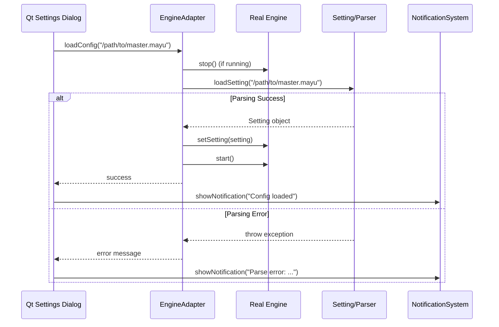

# Design: Qt Engine Integration

## Architecture Overview

### Current State (Stub Implementation)
```
main_qt.cpp
├── class Engine { } (stub - 172 lines)
│   ├── Mock methods (getIsEnabled, start, stop, etc.)
│   └── Fake data (m_keyCount, m_configPath, etc.)
├── TrayIconQt (Qt GUI)
├── IPCControlServer (IPC commands)
└── SessionManager (state persistence)
```

### Target State (Real Engine Integration)
```
main_qt.cpp
├── #include "core/engine/engine.h" (real engine)
├── Engine* g_engine (real instance)
│   ├── InputHookLinux (evdev input capture)
│   ├── InputInjectorLinux (uinput key injection)
│   ├── WindowSystemLinux (X11 window management)
│   └── Setting/Parser (`.mayu` file processing)
├── EngineAdapter (bridge between Qt GUI and core Engine)
├── TrayIconQt (Qt GUI - unchanged)
├── IPCControlServer (enhanced with real commands)
└── SessionManager (enhanced state management)
```

## Component Design

### 1. Engine Initialization

#### Current Stub
```cpp
// Stub Engine class definition in main_qt.cpp (lines 21-172)
class Engine {
    bool m_enabled = true;
    bool m_running = false;
    std::string m_configPath;
    // ... mock implementation
};

Engine* engine = new Engine();
```

#### Proposed Design
```cpp
#include "core/engine/engine.h"
#include "platform/linux/input_hook_linux.h"
#include "platform/linux/input_injector_linux.h"
#include "platform/linux/window_system_linux.h"

// Create platform implementations
auto inputHook = std::make_unique<yamy::platform::InputHookLinux>();
auto inputInjector = std::make_unique<yamy::platform::InputInjectorLinux>();
auto windowSystem = std::make_unique<yamy::platform::WindowSystemLinux>();

// Create real engine with platform dependencies
Engine* engine = new Engine(
    std::move(inputHook),
    std::move(inputInjector),
    std::move(windowSystem)
);
```

**Rationale**: Dependency injection allows the Engine to remain platform-agnostic while using Linux-specific implementations.

### 2. EngineAdapter Pattern

The Qt GUI expects a simpler interface than the full Engine API. We'll create an adapter.

#### Interface Design
```cpp
class EngineAdapter {
public:
    explicit EngineAdapter(Engine* engine) : m_engine(engine) {}

    // Status queries (matching stub interface)
    bool getIsEnabled() const { return m_engine->m_isEnabled; }
    bool isRunning() const { return m_engine->isRunning(); }
    uint64_t keyCount() const { return m_engine->getKeyCount(); }

    // Control methods
    void enable() { m_engine->enable(); }
    void disable() { m_engine->disable(); }
    void start();  // Complex - needs thread management
    void stop();   // Complex - needs cleanup

    // Configuration
    bool loadConfig(const std::string& path);
    std::string getConfigPath() const;

    // JSON status (for IPC compatibility)
    std::string getStatusJson() const;
    std::string getConfigJson() const;
    std::string getKeymapsJson() const;
    std::string getMetricsJson() const;

private:
    Engine* m_engine;
    std::string m_configPath;
    std::thread m_engineThread;
};
```

**Rationale**: The adapter pattern decouples the Qt GUI from the complex Engine API, providing a stable interface that matches the stub.

### 3. Configuration Loading Flow



### 4. IPC Command Integration

The IPCControlServer needs to be enhanced to work with the real Engine.

#### Command Mapping
| IPC Command | Current Stub | Real Engine Integration |
|-------------|--------------|-------------------------|
| `start` | `engine->start()` | `adapter->start()` (creates thread, calls `engine->start()`) |
| `stop` | `engine->stop()` | `adapter->stop()` (signals thread, calls `engine->stop()`) |
| `reload` | `engine->setConfigPath()` | `adapter->loadConfig()` (full reload with parsing) |
| `status` | `engine->getStatusJson()` | `adapter->getStatusJson()` (real metrics) |
| `config` | Mock data | Real config path and loaded keymaps |
| `metrics` | Mock metrics | Real performance metrics from Engine |

#### Implementation Strategy
```cpp
// In main_qt.cpp IPC handler
case yamy::platform::ControlCommand::Reload: {
    try {
        bool success = adapter->loadConfig(data);
        if (success) {
            result.success = true;
            result.message = "Configuration reloaded: " + data;
        } else {
            result.success = false;
            result.message = "Failed to load configuration";
        }
    } catch (const std::exception& e) {
        result.success = false;
        result.message = std::string("Error: ") + e.what();
    }
    break;
}
```

### 5. Thread Management

The real Engine runs keyboard event processing in a separate thread. We need proper lifecycle management.

#### Design
```cpp
void EngineAdapter::start() {
    if (m_engineThread.joinable()) {
        stop(); // Ensure clean state
    }

    m_engine->enable();
    m_engineThread = std::thread([this]() {
        m_engine->start(); // Blocks until stop() is called
    });
}

void EngineAdapter::stop() {
    if (m_engineThread.joinable()) {
        m_engine->stop(); // Signals engine to exit
        m_engineThread.join(); // Wait for thread to finish
    }
    m_engine->disable();
}

EngineAdapter::~EngineAdapter() {
    stop(); // Ensure thread is joined on destruction
}
```

**Rationale**: RAII ensures the engine thread is properly cleaned up.

### 6. Session State Management

Extend SessionManager to persist real engine configuration.

#### Current Schema
```cpp
struct SessionData {
    std::string activeConfigPath;
    bool engineWasRunning;
    QDateTime savedAt;
};
```

#### Enhanced Schema
```cpp
struct SessionData {
    std::string activeConfigPath;
    bool engineWasRunning;
    bool engineWasEnabled;
    std::string currentKeymap; // From real engine
    QDateTime savedAt;
    std::vector<std::string> recentConfigs; // History
};
```

### 7. Error Handling Strategy

#### Parsing Errors
```cpp
bool EngineAdapter::loadConfig(const std::string& path) {
    try {
        // Validate file exists
        if (!std::filesystem::exists(path)) {
            throw std::runtime_error("Config file not found: " + path);
        }

        // Parse configuration
        Setting* setting = loadSetting(path);

        // Apply to engine
        m_engine->setSetting(setting);
        m_configPath = path;

        return true;

    } catch (const ParserException& e) {
        // Log parse error with line number
        std::cerr << "Parse error in " << path << ":"
                  << e.lineNumber() << " - " << e.what() << std::endl;
        return false;
    } catch (const std::exception& e) {
        std::cerr << "Failed to load config: " << e.what() << std::endl;
        return false;
    }
}
```

#### Runtime Errors
- Input device errors: Log and continue with available devices
- Window system errors: Graceful degradation
- IPC errors: Return error status, don't crash

### 8. Notification Integration

Connect engine events to Qt notifications.

```cpp
// In EngineAdapter or main_qt.cpp
void EngineAdapter::start() {
    // ... start engine thread ...

    emit engineStateChanged(MessageType::EngineStarting);

    // After successful start
    emit engineStateChanged(MessageType::EngineRunning);
}
```

## Data Flow

### Configuration Reload Flow
```
User → Settings Dialog → adapter->loadConfig(path)
    → Engine::stop()
    → Parser::loadSetting(path)
    → Engine::setSetting(setting)
    → Engine::start()
    → SessionManager::save(configPath)
    → NotificationSystem::show("Config loaded")
```

### Keyboard Event Flow
```
Physical Key Press
    → evdev (InputHookLinux)
    → Engine::processKeyEvent()
    → Keymap lookup & transformation
    → Engine::injectKey() (via InputInjectorLinux)
    → uinput device
    → Virtual Key Press
```

## File Structure

```
src/app/main_qt.cpp
├── Remove stub Engine class (lines 21-172)
├── Add EngineAdapter class
├── Update engine initialization
└── Update IPC command handlers

src/app/engine_adapter.h (new file)
└── EngineAdapter class declaration

src/app/engine_adapter.cpp (new file)
└── EngineAdapter implementation
```

## Testing Strategy

### Unit Tests
- EngineAdapter methods (start, stop, loadConfig)
- JSON serialization (getStatusJson, etc.)
- Error handling paths

### Integration Tests
1. **Config Loading Test**: Load a valid .mayu file, verify engine applies it
2. **Error Handling Test**: Load invalid .mayu file, verify error is caught
3. **IPC Test**: Send reload command via socket, verify config is reloaded
4. **Session Test**: Save/restore engine state across restart

### Manual Testing
1. Start yamy, load master.mayu, press remapped keys
2. Enable/disable via tray icon, verify key remapping stops
3. Reload config via Settings dialog, verify changes apply
4. Use yamy-ctl commands, verify real engine responds

## Performance Considerations

### Optimization Strategies
1. **Lazy Initialization**: Only parse config when needed
2. **Thread Pool**: Reuse engine thread instead of recreating
3. **Config Caching**: Cache parsed settings to avoid re-parsing

### Memory Management
- Engine owns platform implementations (unique_ptr)
- EngineAdapter owns Engine instance
- Qt application owns EngineAdapter
- RAII ensures proper cleanup

## Migration Plan

### Phase 1: Stub Replacement (Non-functional)
1. Remove stub Engine class
2. Include real Engine headers
3. Create EngineAdapter skeleton
4. Update main() to instantiate real Engine
5. Verify compilation

### Phase 2: Basic Integration (Minimal functionality)
1. Implement EngineAdapter::start/stop
2. Implement basic status queries
3. Update IPC handlers
4. Verify GUI still works (even if engine doesn't remap keys yet)

### Phase 3: Configuration Loading
1. Implement loadConfig()
2. Connect Settings dialog to adapter
3. Add error notifications
4. Test with real .mayu files

### Phase 4: Full Integration
1. Implement all JSON status methods
2. Add session persistence
3. Connect all IPC commands
4. Performance testing and optimization

## Risk Mitigation

| Risk | Mitigation |
|------|-----------|
| Engine API incompatibility | Use adapter pattern for abstraction |
| Threading issues | RAII for thread lifecycle, proper synchronization |
| Config parsing failures | Comprehensive error handling, validation |
| Performance degradation | Profile and optimize, maintain <10ms latency |
| GUI responsiveness | Engine runs in separate thread, IPC is async |

## Acceptance Criteria

- [ ] Real Engine is instantiated instead of stub
- [ ] Configuration files (.mayu) are parsed and applied
- [ ] Keyboard input is actually remapped
- [ ] All Qt GUI features continue to work
- [ ] IPC commands return real data
- [ ] Session state is persisted and restored
- [ ] No memory leaks or crashes during operation
- [ ] Performance meets NFR-1 requirements
