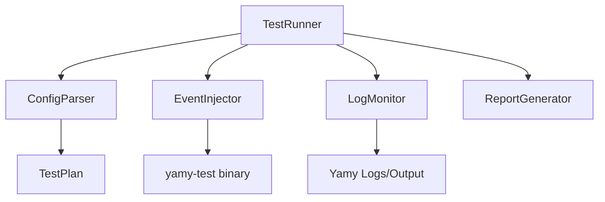

# Design Document: Refactor E2E Test Infrastructure

## Architecture

The refactored framework will follow a modular design, separating the concerns of parsing, execution, and reporting.



## Python Component Design

### 1. `ConfigParser` (`tests/framework/parser.py`)

Responsible for reading `.mayu` files and generating a `TestPlan`.

```python
@dataclass
class TestCase:
    name: str
    input_sequence: List[int]
    expected_output: List[int]
    description: str

class ConfigParser:
    def parse(self, path: str) -> List[TestCase]:
        ...
```

### 2. `EventInjector` (`tests/framework/injector.py`)

Wraps the `yamy-test` binary interaction.

```python
class EventInjector:
    def start(self): ...
    def stop(self): ...
    def inject_press(self, code: int): ...
    def inject_release(self, code: int): ...
    def inject_wait(self, ms: int): ...
```

### 3. `LogMonitor` (`tests/framework/monitor.py`)

Monitors YAMY's output (either via `evdev` device or log file tailing).

```python
class LogMonitor:
    def start_capture(self): ...
    def get_captured_events(self, timeout: float) -> List[int]: ...
    def clear(self): ...
```

### 4. `ReportGenerator` (`tests/framework/reporter.py`)

Generates reports in various formats.

```python
class ReportGenerator:
    def add_result(self, result: TestResult): ...
    def save_xml(self, path: str): ...
    def save_json(self, path: str): ...
```

## Technical Specifications (Guard Rails)

### Directory Structure
```
tests/
  framework/
    __init__.py
    parser.py
    injector.py
    monitor.py
    reporter.py
    runner.py
  e2e/
    test_runner.py  <-- Entry point
```

### Dependencies
- `python3-evdev` (for monitor)
- `junit-xml` (optional, for XML reporting)

### `yamy-test` Protocol
The injector will continue to use the text-based protocol over stdin/stdout with `yamy-test interactive`.
- `PRESS <code>` -> `OK`
- `RELEASE <code>` -> `OK`
- `WAIT <ms>` -> `OK`
