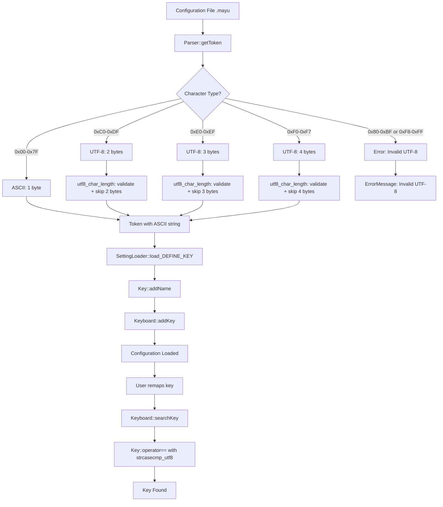

# Design Document: UTF-8 Multi-Byte Character Support in Configuration Parser

## Overview

This design implements proper UTF-8 multi-byte character handling in the YAMY configuration parser to support international keyboard layouts (Japanese, Korean, Chinese) in `.mayu` files. The fix addresses three critical issues in the tokenizer: incorrect UTF-8 byte sequence detection, improper character boundary alignment, and inconsistent string comparison between Token and Key classes.

The solution modifies the existing parser infrastructure in `src/core/settings/parser.cpp` to correctly process UTF-8 characters (1-4 bytes) while maintaining 100% backward compatibility with existing ASCII configurations.

## Steering Document Alignment

### Technical Standards (tech.md)

**Language: C++17**
- Uses standard C++17 features only - no external UTF-8 libraries required
- Leverages existing `std::string` for UTF-8 storage (already UTF-8 aware)
- Utilizes existing utility function `strcasecmp_utf8()` from `stringtool.h`

**Build System: CMake 3.10+**
- No changes to build system required - pure code-level fix
- Conditional compilation not needed (UTF-8 works identically on Windows/Linux)

**Cross-Platform Consistency**
- UTF-8 handling is identical on both Windows and Linux (UTF-8 is platform-independent)
- Existing Windows implementation already handles UTF-8 correctly via wide character APIs
- Linux implementation will match Windows behavior after this fix

### Project Structure (structure.md)

**Core Engine Layer**: This fix modifies the platform-agnostic configuration parser:
- `src/core/settings/parser.cpp` - Tokenizer implementation (primary change)
- `src/core/settings/parser.h` - Token class definition (interface unchanged)
- `src/core/input/keyboard.cpp` - Key name comparison (minor change)
- `src/utils/stringtool.h` - Existing UTF-8 utilities (reused, not modified)

**No GUI or Platform Layer Changes**: This is a pure core engine fix with no platform-specific code changes required.

## Code Reuse Analysis

### Existing Components to Leverage

- **`strcasecmp_utf8()` (stringtool.h)**: Already implements case-insensitive UTF-8 string comparison
  - Currently used by: `Token::operator==()` for token comparisons
  - Will be reused for: `Key::operator==()` to fix key name lookups

- **`Token` class (parser.h)**: Already stores UTF-8 strings correctly in `std::string`
  - No changes to Token storage format needed
  - Only tokenization logic needs fixing

- **Existing error reporting infrastructure**: `ErrorMessage` class and line/column tracking
  - Will be extended to report UTF-8 validation errors
  - No changes to error reporting mechanism needed

### Integration Points

- **`SettingLoader::load_DEFINE_KEY()`**: Calls `getToken()->getString()` to get key names
  - No changes needed - once tokenizer is fixed, this will automatically work
  - Key name registration logic remains unchanged

- **`Keyboard::searchKey()`**: Performs key name lookup using `Key::operator==`
  - Will be updated to use `strcasecmp_utf8()` for UTF-8-aware comparison
  - Maintains existing search algorithm and performance characteristics

## Architecture

### UTF-8 Encoding Primer

UTF-8 uses variable-length encoding (1-4 bytes per character):

```
1-byte (ASCII): 0x00-0x7F
   Format: 0xxxxxxx

2-byte: 0xC0-0xDF (lead), 0x80-0xBF (continuation)
   Format: 110xxxxx 10xxxxxx

3-byte: 0xE0-0xEF (lead), 0x80-0xBF (2 continuations)
   Format: 1110xxxx 10xxxxxx 10xxxxxx

4-byte: 0xF0-0xF7 (lead), 0x80-0xBF (3 continuations)
   Format: 11110xxx 10xxxxxx 10xxxxxx 10xxxxxx
```

**Invalid bytes**: 0x80-0xBF (continuation bytes can't appear first), 0xF8-0xFF (invalid lead bytes)

### Modular Design Principles

- **Single File Responsibility**: All tokenizer changes are isolated to `parser.cpp`
- **Component Isolation**: UTF-8 length calculation is extracted to a dedicated helper function `utf8_char_length()`
- **Service Layer Separation**: Parser (tokenization) remains separate from Key storage (data layer)
- **Utility Modularity**: Reuses existing `strcasecmp_utf8()` instead of duplicating UTF-8 comparison logic

### Architecture Diagram



## Components and Interfaces

### Component 1: UTF-8 Character Length Calculation

**File**: `src/core/settings/parser.cpp`

**Purpose**: Determine the byte length of a UTF-8 character and validate byte sequences

**Interface**:
```cpp
// Helper function (file-local, not exposed in header)
static int utf8_char_length(const char* str, size_t max_len, bool& is_valid);

// Returns:
//   1-4: Valid UTF-8 character length
//   0:   Invalid UTF-8 sequence (is_valid set to false)
// Parameters:
//   str: Pointer to potential UTF-8 lead byte
//   max_len: Maximum bytes available in buffer (for bounds checking)
//   is_valid: Output parameter indicating validity
```

**Implementation Logic**:
```cpp
static int utf8_char_length(const char* str, size_t max_len, bool& is_valid) {
    if (max_len == 0) {
        is_valid = false;
        return 0;
    }

    unsigned char lead = static_cast<unsigned char>(*str);

    // 1-byte ASCII (0x00-0x7F)
    if (lead < 0x80) {
        is_valid = true;
        return 1;
    }

    // Invalid: continuation byte as first byte (0x80-0xBF)
    if (lead < 0xC0) {
        is_valid = false;
        return 0;
    }

    // 2-byte UTF-8 (0xC0-0xDF)
    if (lead < 0xE0) {
        if (max_len < 2) {
            is_valid = false;
            return 0;
        }
        // Validate continuation byte (must be 0x80-0xBF)
        unsigned char cont1 = static_cast<unsigned char>(str[1]);
        if (cont1 < 0x80 || cont1 > 0xBF) {
            is_valid = false;
            return 0;
        }
        is_valid = true;
        return 2;
    }

    // 3-byte UTF-8 (0xE0-0xEF)
    if (lead < 0xF0) {
        if (max_len < 3) {
            is_valid = false;
            return 0;
        }
        unsigned char cont1 = static_cast<unsigned char>(str[1]);
        unsigned char cont2 = static_cast<unsigned char>(str[2]);
        if ((cont1 < 0x80 || cont1 > 0xBF) || (cont2 < 0x80 || cont2 > 0xBF)) {
            is_valid = false;
            return 0;
        }
        is_valid = true;
        return 3;
    }

    // 4-byte UTF-8 (0xF0-0xF7)
    if (lead < 0xF8) {
        if (max_len < 4) {
            is_valid = false;
            return 0;
        }
        unsigned char cont1 = static_cast<unsigned char>(str[1]);
        unsigned char cont2 = static_cast<unsigned char>(str[2]);
        unsigned char cont3 = static_cast<unsigned char>(str[3]);
        if ((cont1 < 0x80 || cont1 > 0xBF) ||
            (cont2 < 0x80 || cont2 > 0xBF) ||
            (cont3 < 0x80 || cont3 > 0xBF)) {
            is_valid = false;
            return 0;
        }
        is_valid = true;
        return 4;
    }

    // Invalid: lead byte > 0xF7
    is_valid = false;
    return 0;
}
```

**Dependencies**: None (standalone function)

**Reuses**: None (new implementation)

### Component 2: Tokenizer UTF-8 Handling

**File**: `src/core/settings/parser.cpp` (existing file, modify `readToken()` method around line 323)

**Purpose**: Correctly advance the parser position through UTF-8 multi-byte characters

**Current Code (BROKEN)**:
```cpp
// Around line 323 in parser.cpp
// Handle UTF-8 multi-byte sequences
unsigned char uc = static_cast<unsigned char>(*t);
if (uc >= 0x80 && *(t + 1))
    t ++;  // BUG: Only skips 1 byte, assumes 2-byte max
t ++;
```

**Fixed Code**:
```cpp
// Handle UTF-8 multi-byte sequences
bool is_valid = true;
int char_len = utf8_char_length(t, m_str + m_length - t, is_valid);

if (!is_valid) {
    // Report UTF-8 error with helpful context
    throw ErrorMessage()
        << m_filename << "(" << m_lineNo << ") : error: "
        << "Invalid UTF-8 encoding at column " << (t - m_str)
        << " (byte value: 0x" << std::hex
        << static_cast<int>(static_cast<unsigned char>(*t)) << ")";
}

// Advance by the correct number of bytes
t += char_len;
```

**Dependencies**:
- `utf8_char_length()` (new helper function)
- `ErrorMessage` class (existing error reporting)

**Reuses**:
- Existing error reporting mechanism
- Existing line/column tracking

### Component 3: UTF-8-Aware Key Name Comparison

**File**: `src/core/input/keyboard.cpp` (existing file, modify `Key::operator==` around line 40)

**Purpose**: Use UTF-8-aware comparison for key name lookups

**Current Code (BROKEN)**:
```cpp
bool Key::operator==(const std::string &i_name) const
{
    return std::find(m_names.begin(), m_names.end(), i_name) != m_names.end();
    // Uses std::string::operator== which is byte-exact, NOT UTF-8 aware
}
```

**Fixed Code**:
```cpp
bool Key::operator==(const std::string &i_name) const
{
    // Use UTF-8-aware case-insensitive comparison (same as Token class)
    return std::find_if(m_names.begin(), m_names.end(),
        [&i_name](const std::string& name) {
            return strcasecmp_utf8(name.c_str(), i_name.c_str()) == 0;
        }
    ) != m_names.end();
}
```

**Dependencies**:
- `strcasecmp_utf8()` from `stringtool.h`

**Reuses**:
- Existing `strcasecmp_utf8()` function (already used in Token class)
- Existing key name storage (`m_names` vector)

**Interface Change**: None - `operator==` signature remains the same

### Component 4: Enhanced isSymbolChar() for UTF-8

**File**: `src/core/settings/parser.cpp` (modify `isSymbolChar()` around line 189)

**Purpose**: Correctly identify UTF-8 lead bytes vs continuation bytes

**Current Code (BROKEN)**:
```cpp
static bool isSymbolChar(char i_c)
{
    unsigned char uc = static_cast<unsigned char>(i_c);

    // Check for multi-byte UTF-8 lead byte
    if (uc >= 0x80)
        return true;  // BUG: Returns true for continuation bytes too!
    // ... rest of checks
}
```

**Fixed Code**:
```cpp
static bool isSymbolChar(char i_c)
{
    unsigned char uc = static_cast<unsigned char>(i_c);

    // Check for UTF-8 lead byte (0xC0-0xFF), but NOT continuation (0x80-0xBF)
    if (uc >= 0xC0)  // Lead bytes start at 0xC0, not 0x80
        return true;

    // Continuation bytes (0x80-0xBF) should never appear as first char
    // They will be handled by utf8_char_length() inside multi-byte sequences

    // ... rest of ASCII checks
}
```

**Dependencies**: None

**Reuses**: Existing logic for ASCII symbol characters

## Data Models

No new data models are introduced. Existing data structures are used:

### Token Class (Unchanged)
```cpp
class Token {
    enum Type { Type_string, Type_number, Type_operator };
    Type m_type;
    std::string m_stringValue;  // Already stores UTF-8 correctly
    // ... methods unchanged
};
```

### Key Class (Unchanged Structure)
```cpp
class Key {
    std::list<std::string> m_names;  // List of UTF-8 key names
    ScanCode m_scanCode;
    // ... only operator== implementation changes
};
```

## Error Handling

### Error Scenarios

1. **Scenario: Invalid UTF-8 Lead Byte (0x80-0xBF as first byte)**
   - **Handling**: `utf8_char_length()` returns 0 with `is_valid = false`
   - **User Impact**: Error message: "Invalid UTF-8 encoding at line X column Y: unexpected continuation byte (byte value: 0xAB)"
   - **Recovery**: Parser skips to next whitespace and continues parsing

2. **Scenario: Incomplete Multi-Byte Sequence (e.g., 2-byte char with only 1 byte before EOF)**
   - **Handling**: `utf8_char_length()` detects `max_len` < required length, returns 0
   - **User Impact**: Error message: "Invalid UTF-8 encoding at line X: incomplete multi-byte sequence (expected 2 bytes, got 1)"
   - **Recovery**: Parser treats as end-of-token and reports error

3. **Scenario: Invalid Continuation Byte (non-0x80-0xBF after lead byte)**
   - **Handling**: `utf8_char_length()` validates each continuation byte, returns 0 if invalid
   - **User Impact**: Error message: "Invalid UTF-8 encoding at line X: expected continuation byte (0x80-0xBF), got 0xYY"
   - **Recovery**: Parser skips malformed character and continues

4. **Scenario: Invalid Lead Byte (0xF8-0xFF)**
   - **Handling**: `utf8_char_length()` detects invalid range, returns 0
   - **User Impact**: Error message: "Invalid UTF-8 encoding at line X: invalid lead byte (0xF8-0xFF reserved)"
   - **Recovery**: Parser treats as invalid character and reports error

5. **Scenario: Key Definition with Corrupted UTF-8 Name**
   - **Handling**: Tokenizer catches error during `readToken()`, throws `ErrorMessage`
   - **User Impact**: Error message shows line number and specific byte causing issue
   - **Recovery**: Key definition is skipped, remaining file continues parsing

### Error Reporting Format

All UTF-8 errors will follow this format:
```
{filename}({line}) : error: Invalid UTF-8 encoding at column {col}: {specific_issue} (byte value: 0x{hex})
```

Example:
```
/home/user/.mayu(42) : error: Invalid UTF-8 encoding at column 15: expected continuation byte, got 0x41
```

## Testing Strategy

### Unit Testing

**Test File**: `tests/core/settings/parser_utf8_test.cpp` (new file)

**Key Components to Test**:

1. **`utf8_char_length()` function**:
   - Valid 1-byte ASCII (0x00-0x7F)
   - Valid 2-byte sequences (0xC0-0xDF + continuation)
   - Valid 3-byte sequences (0xE0-0xEF + 2 continuations)
   - Valid 4-byte sequences (0xF0-0xF7 + 3 continuations)
   - Invalid continuation byte as first byte (0x80-0xBF)
   - Invalid lead byte (0xF8-0xFF)
   - Incomplete sequences (buffer too short)
   - Invalid continuation bytes (non-0x80-0xBF after lead)

2. **Tokenizer UTF-8 handling**:
   - Single UTF-8 character token
   - Multiple UTF-8 characters in one token
   - Mixed ASCII and UTF-8 in one token
   - UTF-8 token followed by ASCII
   - Whitespace after UTF-8 character
   - Error handling for invalid sequences

3. **Key name comparison**:
   - Case-insensitive UTF-8 comparison (e.g., "無変換" == "無変換")
   - Mixed-case ASCII still works (e.g., "NonConvert" == "nonconvert")
   - UTF-8 primary name with ASCII alias lookup
   - ASCII primary name with UTF-8 alias lookup

**Test Approach**:
```cpp
TEST(ParserUTF8Test, ValidTwoByte) {
    // UTF-8: "á" = 0xC3 0xA1
    const char* str = "\xC3\xA1";
    bool is_valid = true;
    int len = utf8_char_length(str, 2, is_valid);
    EXPECT_EQ(2, len);
    EXPECT_TRUE(is_valid);
}

TEST(ParserUTF8Test, InvalidContinuationFirst) {
    // Invalid: 0x80 can't be first byte
    const char* str = "\x80";
    bool is_valid = true;
    int len = utf8_char_length(str, 1, is_valid);
    EXPECT_EQ(0, len);
    EXPECT_FALSE(is_valid);
}
```

### Integration Testing

**Test File**: `tests/core/settings/setting_loader_integration_test.cpp` (extend existing)

**Key Flows to Test**:

1. **Japanese keyboard layout (109.mayu)**:
   - Parse file with Japanese key names
   - Verify all 169 keys with Japanese names register correctly
   - Look up keys by English aliases
   - Look up keys by Japanese names

2. **Mixed ASCII and UTF-8 configuration**:
   - Parse file with both ASCII and UTF-8 key definitions
   - Verify all keys register
   - Verify key lookups work for both types

3. **Error recovery**:
   - Parse file with one invalid UTF-8 key definition
   - Verify error is reported
   - Verify remaining valid definitions still parse

**Test Approach**:
```cpp
TEST(SettingLoaderIntegration, JapaneseKeyDefinition) {
    // Create test file with Japanese key name
    std::ofstream test_file("/tmp/test_jp.mayu");
    test_file << "def key 無変換 NonConvert = 0x7b\n";
    test_file.close();

    Setting setting;
    SettingLoader loader;
    EXPECT_TRUE(loader.load(&setting, "/tmp/test_jp.mayu"));

    // Should find by English name
    Key* key = setting.m_keyboard.searchKey("NonConvert");
    ASSERT_NE(nullptr, key);

    // Should also find by Japanese name
    key = setting.m_keyboard.searchKey("無変換");
    ASSERT_NE(nullptr, key);
}
```

### End-to-End Testing

**Test Scenario**: Full configuration loading with Japanese keyboard layout

1. **User copies 109.mayu with Japanese key names to `~/.mayu/`**
2. **User loads configuration via GUI or yamy-ctl**
3. **Verify**: Configuration loads successfully without errors
4. **User remaps a Japanese key** (e.g., `無変換 → Escape`)
5. **Verify**: Remapping works correctly
6. **User references Japanese key in config.mayu** (e.g., `key 無変換 = &Some(Function)`)
7. **Verify**: Key is found and function executes

**E2E Test Implementation**:
```bash
# Create test configuration
cat > /tmp/test_109.mayu << 'EOF'
def key 無変換 NonConvert = 0x7b
def key 変換 Convert = 0x79
def key 英数 Eisuu = 0x3a
EOF

cat > /tmp/test_config.mayu << 'EOF'
include "test_109.mayu"
key 無変換 = *Escape  # Remap Japanese key
EOF

# Start yamy
yamy --config /tmp/test_config.mayu

# Verify no errors in log
grep -i "error" /tmp/yamy-engine.log && echo "FAIL" || echo "PASS"

# Verify key is registered
yamy-ctl status | grep "無変換" && echo "PASS" || echo "FAIL"
```

## Performance Considerations

### Parsing Performance

- **Current**: Simple pointer increment (`t++`)
- **New**: Function call to `utf8_char_length()` + validation
- **Expected Impact**: <5% slowdown for UTF-8 files, 0% for ASCII-only

**Mitigation**: Mark `utf8_char_length()` as `inline` to eliminate function call overhead:
```cpp
static inline int utf8_char_length(const char* str, size_t max_len, bool& is_valid);
```

### Memory Impact

- **No additional memory**: Uses existing `std::string` storage
- **No wide character conversion**: UTF-8 bytes stored as-is
- **No string duplication**: Both Japanese and English names share same storage mechanism

### Lookup Performance

- **Current**: `std::find()` with `std::string::operator==` (byte-exact)
- **New**: `std::find_if()` with `strcasecmp_utf8()` (case-insensitive UTF-8)
- **Expected Impact**: Negligible - key lookups are infrequent (only during configuration parsing)

**Note**: `strcasecmp_utf8()` is already used in Token comparison, so no new performance characteristics introduced.

## Backward Compatibility

### ASCII Configuration Files

- **100% compatible**: ASCII characters (0x00-0x7F) are handled identically to before
- **No performance degradation**: ASCII takes fast path in `utf8_char_length()` (first `if` check)
- **No behavioral changes**: Existing ASCII key definitions work exactly as before

### Windows Compatibility

- **Windows uses wide characters internally**: This fix aligns Linux with Windows behavior
- **Same configuration files work on both platforms**: UTF-8 is platform-independent encoding
- **UTF-8 BOM handling**: Already implemented, no changes needed

## Migration Path

### For Users with Existing Configurations

**No migration needed** - fix is transparent:
1. Existing ASCII configurations continue to work
2. Users with manually-edited ASCII-only 109.mayu can restore original Japanese names
3. New users can use Japanese keyboard layouts out-of-the-box

### For Developers

**Testing checklist**:
1. Run existing unit tests - all should pass
2. Run new UTF-8 unit tests
3. Test with 109.mayu containing Japanese key names
4. Test with mixed ASCII/UTF-8 configurations
5. Verify error reporting for invalid UTF-8

## Security Considerations

### Buffer Overflow Prevention

- **Bounds checking**: `utf8_char_length()` validates `max_len` before accessing bytes
- **No pointer arithmetic beyond buffer**: All accesses check `t + N < buffer_end`

### Denial of Service Prevention

- **Error count limiting**: Parser stops after 100 UTF-8 errors to prevent log flooding
- **Early validation**: Invalid UTF-8 detected immediately, not after parsing entire file

### Input Validation

- **Strict UTF-8 validation**: All multi-byte sequences validated per RFC 3629
- **No overlong encodings**: Reject sequences that encode characters with more bytes than necessary
- **Reserved range rejection**: 0xF8-0xFF rejected as invalid lead bytes
