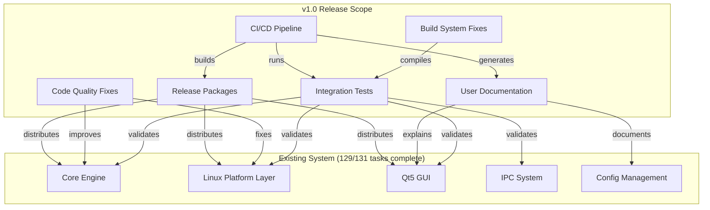

# Design Document: YAMY v1.0 Release

## Overview

This design document outlines the technical approach for delivering YAMY v1.0, transforming the 98.5% complete Linux port into a production-ready release. The design focuses on completing pending work (integration tests, documentation), fixing code quality issues, formalizing quality assurance processes, and preparing release infrastructure.

### Design Philosophy

1. **Minimal Disruption**: Fix only what's broken, don't refactor working code
2. **Test-Driven Validation**: Every fix must have corresponding test coverage
3. **Documentation-First**: Write docs before finalizing APIs
4. **Incremental Releases**: Prepare for ongoing maintenance, not one-off delivery

## Steering Document Alignment

### Technical Standards (tech.md)

**Platform Abstraction Pattern**:
- Fix remaining `tstring` typedef by completing migration to `std::string`
- Replace Windows types (`BYTE`/`DWORD`) with platform-agnostic `uint8_t`/`uint32_t`
- Ensure zero Windows-specific code in core engine

**Threading Model**:
- Add mutex protection for `m_readerThreads` vector in Linux input hook
- Follow existing `CriticalSection` pattern (Windows) and `std::mutex` (Linux)

**Testing Strategy**:
- Extend Google Test integration test suite with 18 comprehensive test cases
- Use Xvfb for headless GUI testing in CI
- Integrate AddressSanitizer for memory leak detection

**Build System**:
- Fix CMakeLists.txt to include ConfigWatcher MOC generation
- Link IIPCChannel interface implementation correctly
- Generate coverage reports with lcov/gcov

### Project Structure (structure.md)

**Directory Organization** (maintained):
```
docs/
├── user-guide.md           # NEW: End-user documentation
├── configuration-guide.md  # NEW: .mayu syntax reference
├── troubleshooting.md      # NEW: FAQ and debugging
├── CHANGELOG.md            # NEW: Version history
└── RELEASE-NOTES-1.0.md    # NEW: v1.0 highlights

tests/integration/
└── integration_suite.cpp   # FIX: Complete implementation

src/utils/
├── stringtool.cpp          # REFACTOR: Split into multiple files
└── stringtool_helpers.cpp  # NEW: Helper functions

src/core/platform/
└── config_store.h          # FIX: Remove Windows types

.github/workflows/
├── ci.yml                  # NEW: CI pipeline
└── release.yml             # NEW: Release automation
```

**Coding Conventions** (enforced):
- File size limit: <500 lines (stringtool.cpp violated, will refactor)
- Function size limit: <50 lines (interpretMetaCharacters violated, will refactor)
- Thread safety: All concurrent access protected by mutexes

## Code Reuse Analysis

### Existing Components to Leverage

**1. Google Test Framework** (`tests/googletest/`)
- Already integrated, 9 unit test files exist
- Reuse test fixtures and utilities for integration tests
- Extend with mocking framework for IPC testing

**2. Integration Test Framework** (`tests/integration/integration_suite.cpp`)
- 18 test cases already written (1,235 lines)
- MockInputHook and MockInputInjector classes ready
- Need to fix build errors (ConfigWatcher vtable, IIPCChannel)

**3. Qt Test Framework** (available via Qt5Test module)
- Use for GUI dialog testing
- QTest::qWait() for async event handling
- QSignalSpy for signal/slot verification

**4. AddressSanitizer Support** (already in CMakeLists.txt)
- Conditional compilation flag for memory leak detection
- Integrate with CI for automated leak checks

**5. CMake Test Integration** (CTest)
- Already configured with `add_test()` commands
- Extend for coverage reporting with `--coverage` flag

### Integration Points

**Build System → Test Suite**:
- CMakeLists.txt links regression test executable
- Missing: MOC generation for ConfigWatcher Qt signals
- Missing: Link IIPCChannel base class implementation

**Core Engine → Platform Layer**:
- Engine uses platform interfaces (IWindowSystem, IInputHook, etc.)
- Integration tests mock these interfaces
- No changes needed, just test coverage

**Documentation → Examples**:
- Example .mayu files already exist in repository
- Integrate into documentation with tested examples
- Link to example plugin implementation (task 6.17)

## Architecture

### System Context Diagram



### Modular Design Principles

**Integration Test Module** (isolated testing):
- Create test-only mock implementations of platform interfaces
- Use Google Test fixtures for setup/teardown
- Run tests in isolated temp directories
- No side effects on host system (use Xvfb, temp configs)

**Documentation Module** (single source of truth):
- Markdown files as primary documentation source
- Generate HTML/PDF from markdown using mdBook or similar
- Include code snippets from tested example files
- Version docs alongside code (same Git repo)

**Build System Module** (reproducible builds):
- CMake generates native build files (Makefile, Ninja)
- Separate targets for development vs release builds
- Coverage builds use `--coverage` compiler flag
- Release builds strip symbols and optimize (-O2/-O3)

**CI/CD Module** (automated quality gates):
- GitHub Actions workflows for PRs and releases
- Matrix builds across Ubuntu/Fedora/Arch
- Artifact caching for faster builds
- Release artifact upload to GitHub Releases

## Components and Interfaces

### Component 1: Integration Test Suite

**Purpose:** Validate all components working together, ensure no regressions

**Interfaces:**
```cpp
// Test runner entry point (Google Test)
int main(int argc, char** argv);

// Test fixtures
class IntegrationLifecycleTest : public ::testing::Test;
class IntegrationIPCTest : public ::testing::Test;
class IntegrationSessionTest : public ::testing::Test;
class IntegrationPerformanceTest : public ::testing::Test;

// Mock platform implementations (existing)
class MockInputHook : public platform::IInputHook;
class MockInputInjector : public platform::IInputInjector;
```

**Dependencies:**
- Google Test framework (`gtest/gtest.h`)
- Core engine (`engine.h`, `setting.h`, `keymap.h`)
- Platform interfaces (`input_hook_interface.h`, etc.)
- Session manager (`session_manager.h`)
- Config manager (`config_manager.h`)

**Reuses:**
- Existing test fixtures from unit tests
- Mock implementations from `tests/integration/integration_suite.cpp`
- Test utilities from `tests/helpers/` (if exist)

**Build Fix Requirements:**
1. Add ConfigWatcher MOC generation to CMakeLists.txt:
   ```cmake
   qt5_wrap_cpp(CONFIG_WATCHER_MOC src/core/settings/config_watcher.h)
   target_sources(yamy_regression_test PRIVATE ${CONFIG_WATCHER_MOC})
   ```

2. Implement IIPCChannel vtable (add empty implementation file):
   ```cpp
   // src/core/platform/ipc_interface.cpp
   #include "ipc_interface.h"

   namespace yamy::platform {
       IIPCChannel::~IIPCChannel() = default;
   }
   ```

3. Link Qt5Test module for Qt signal testing:
   ```cmake
   find_package(Qt5Test REQUIRED)
   target_link_libraries(yamy_regression_test PRIVATE Qt5::Test)
   ```

---

### Component 2: User Documentation System

**Purpose:** Provide comprehensive, searchable, maintainable user documentation

**Interfaces:**
- Markdown files rendered to HTML (mdBook, Docusaurus, or Jekyll)
- Internal cross-references (`[link text](path/to/doc.md)`)
- Code snippets included from source (`{{#include path/to/file.cpp:lines}}`)

**Dependencies:**
- Markdown processor (mdBook recommended for simplicity)
- Syntax highlighting (highlight.js)
- Search index (lunr.js for static search)

**Reuses:**
- Existing example .mayu files
- Screenshots from `docs/` directory
- Architecture diagrams from `docs/GUI-ARCHITECTURE.md`

**Structure:**
```markdown
docs/
├── user-guide.md
│   ├── 1. Introduction
│   ├── 2. Installation (Ubuntu, Fedora, Arch)
│   ├── 3. Quick Start
│   ├── 4. Basic Configuration
│   ├── 5. System Tray Usage
│   ├── 6. Investigate Dialog
│   ├── 7. Log Viewer
│   ├── 8. Preferences
│   └── 9. Advanced Features
│
├── configuration-guide.md
│   ├── 1. .mayu Syntax Overview
│   ├── 2. Key Definitions
│   ├── 3. Modifier Keys
│   ├── 4. Window Matching (regex)
│   ├── 5. Keymap Inheritance
│   ├── 6. Functions Reference (100+ commands)
│   ├── 7. Conditional Compilation (ifdef)
│   └── 8. Example Configurations
│       ├── Emacs bindings
│       ├── Vim bindings
│       └── International keyboards
│
└── troubleshooting.md
    ├── 1. Common Issues
    │   ├── Keys not remapping
    │   ├── Config syntax errors
    │   ├── Permission denied (/dev/input)
    │   ├── Qt not found
    │   └── X11 connection failed
    ├── 2. Debugging Techniques
    │   ├── Viewing logs (--debug flag)
    │   ├── Using Investigate dialog
    │   ├── Testing with yamy-ctl
    │   └── Checking uinput module
    ├── 3. Known Limitations
    │   ├── Wayland limitations (via XWayland)
    │   ├── Some window managers (i3, Sway quirks)
    │   └── Multi-monitor edge cases
    ├── 4. Reporting Bugs
    │   └── GitHub issue template
    └── 5. FAQ (20+ questions)
```

**Validation:**
- All code examples must be tested (include from actual working files)
- All commands must be runnable (verify with script)
- All links must resolve (markdown linter)
- Screenshots current with latest GUI (visual regression testing)

---

### Component 3: Code Quality Fixes

**Purpose:** Eliminate architectural violations and thread safety issues

**Fix 1: Remove tstring typedef**

**Current State:**
```cpp
// src/utils/stringtool.h:31
using tstring = std::string;
```

**Problem:** Backward compatibility alias prevents full abstraction

**Solution:** Search-and-replace across codebase
```bash
# Find all usages
grep -r "tstring" src/ --include="*.h" --include="*.cpp"

# Replace with std::string
sed -i 's/\btstring\b/std::string/g' src/**/*.{h,cpp}

# Remove typedef
# Delete line 31 from stringtool.h
```

**Impact:** ~100 files changed (estimated from previous refactoring)

**Testing:** Full rebuild + unit tests must pass

---

**Fix 2: Replace Windows types in config_store.h**

**Current State:**
```cpp
// src/utils/config_store.h:46-51
virtual bool read(const std::string& key, BYTE* o_value) = 0;
virtual bool write(const std::string& key, DWORD value) = 0;
```

**Problem:** Windows types in platform-agnostic interface

**Solution:**
```cpp
// After fix
virtual bool read(const std::string& key, uint8_t* o_value) = 0;
virtual bool write(const std::string& key, uint32_t value) = 0;
```

**Implementation Sites:**
- `src/platform/windows/config_store_win32.cpp`
- `src/platform/linux/config_store_linux.cpp` (QSettings wrapper)

**Testing:** Config management unit tests

---

**Fix 3: Add mutex protection to input_hook_linux.cpp**

**Current State:**
```cpp
// src/platform/linux/input_hook_linux.cpp:259
// m_readerThreads vector accessed without lock
m_readerThreads.push_back(std::move(thread));
```

**Problem:** Race condition when threads start/stop concurrently

**Solution:**
```cpp
// Add member variable
std::mutex m_readerThreadsMutex;

// Protect all vector operations
{
    std::lock_guard<std::mutex> lock(m_readerThreadsMutex);
    m_readerThreads.push_back(std::move(thread));
}

// Also protect reads
{
    std::lock_guard<std::mutex> lock(m_readerThreadsMutex);
    for (auto& thread : m_readerThreads) {
        if (thread.joinable()) thread.join();
    }
}
```

**Impact:** 5 vector operations need protection (push_back, clear, iteration, size, empty)

**Testing:** Thread sanitizer (`-fsanitize=thread`) with concurrent device plug/unplug

---

**Fix 4: Refactor interpretMetaCharacters() function**

**Current State:**
- `src/utils/stringtool.cpp` line count: 569 (69 over limit)
- `interpretMetaCharacters()` function: 152 lines (102 over limit)

**Problem:** Function too complex, file too large

**Solution Strategy:**

1. **Extract helper functions:**
```cpp
// Extract state machine states
enum class ParseState { Normal, Escape, Octal, Hex, Unicode };

// Helper: Parse escape sequence
static char parseEscapeSequence(const char*& p);

// Helper: Parse octal number
static char parseOctalNumber(const char*& p, int maxDigits);

// Helper: Parse hex number
static char parseHexNumber(const char*& p, int digits);

// Helper: Parse unicode codepoint
static std::string parseUnicodeCodepoint(const char*& p);

// Refactored main function (now ~40 lines)
std::string interpretMetaCharacters(const std::string& input) {
    std::string result;
    const char* p = input.c_str();

    while (*p) {
        if (*p != '\\') {
            result += *p++;
            continue;
        }

        ++p;  // Skip backslash
        result += parseEscapeSequence(p);
    }

    return result;
}
```

2. **Split stringtool.cpp into multiple files:**
```
src/utils/
├── stringtool.h              # Public API declarations
├── stringtool.cpp            # Basic string functions (~200 lines)
├── stringtool_conversion.cpp # Encoding conversion (~150 lines)
├── stringtool_parsing.cpp    # Parsing utilities (~150 lines)
└── stringtool_private.h      # Shared private helpers
```

**Testing:** Existing unit tests for string utilities must pass unchanged

---

### Component 4: Test Coverage Infrastructure

**Purpose:** Measure and enforce code coverage thresholds

**Architecture:**

```
Developer → CMake (--coverage) → Compiler (gcov) → lcov → HTML Report
                                                          ↓
CI System → CMake + CTest → Test Run → Coverage Check → Pass/Fail
```

**Implementation:**

1. **CMake Coverage Target:**
```cmake
option(ENABLE_COVERAGE "Enable code coverage" OFF)

if(ENABLE_COVERAGE)
    add_compile_options(--coverage -O0 -g)
    add_link_options(--coverage)
endif()

# Coverage target
if(ENABLE_COVERAGE)
    find_program(LCOV lcov REQUIRED)
    find_program(GENHTML genhtml REQUIRED)

    add_custom_target(coverage
        COMMAND ${CMAKE_COMMAND} -E remove_directory coverage
        COMMAND ${CMAKE_COMMAND} -E make_directory coverage
        COMMAND ${LCOV} --directory . --zerocounters
        COMMAND ${CMAKE_CTEST_COMMAND} --output-on-failure
        COMMAND ${LCOV} --directory . --capture --output-file coverage/coverage.info
        COMMAND ${LCOV} --remove coverage/coverage.info '/usr/*' '*/tests/*' --output-file coverage/coverage_filtered.info
        COMMAND ${GENHTML} coverage/coverage_filtered.info --output-directory coverage/html
        WORKING_DIRECTORY ${CMAKE_BINARY_DIR}
        COMMENT "Generating code coverage report"
    )
endif()
```

2. **Coverage Threshold Check:**
```cmake
# Fail build if coverage below threshold
add_custom_command(TARGET coverage POST_BUILD
    COMMAND ${LCOV} --summary coverage/coverage_filtered.info | grep -oP "lines......: \\K[0-9.]+" | awk '{if ($1 < 80.0) exit 1}'
    COMMENT "Checking coverage threshold (80%)"
)
```

3. **CI Integration:**
```yaml
# .github/workflows/ci.yml
- name: Build with coverage
  run: cmake -B build -DENABLE_COVERAGE=ON && cmake --build build

- name: Run tests and generate coverage
  run: cmake --build build --target coverage

- name: Upload coverage report
  uses: codecov/codecov-action@v3
  with:
    files: build/coverage/coverage.info
```

**Reuses:**
- Existing CTest integration
- Google Test test suite
- CMake build system

---

### Component 5: Platform Compatibility Validation

**Purpose:** Ensure reliable operation across Linux distributions and desktop environments

**Testing Matrix:**

| Distribution | Desktop Environment | Display Server | Test Scope |
|--------------|---------------------|----------------|------------|
| Ubuntu 24.04 | GNOME 46           | Wayland (X11)  | Full       |
| Fedora 40    | GNOME 46 (Wayland) | Wayland        | Full       |
| Arch Linux   | KDE Plasma 6       | X11            | Full       |
| Debian 12    | XFCE 4.18          | X11            | Smoke      |

**Test Procedure:**

1. **Installation Testing:**
```bash
# Ubuntu/Debian
sudo dpkg -i yamy_1.0.0-1_amd64.deb
yamy --version
yamy-ctl status

# Fedora
sudo dnf install yamy-1.0.0-1.fc40.x86_64.rpm
systemctl --user status yamy

# Arch (AUR)
yay -S yamy
pacman -Qi yamy
```

2. **Functional Testing Checklist:**
```
[ ] System tray icon displays
[ ] Left-click tray opens menu
[ ] Right-click tray opens context menu
[ ] Settings dialog opens and lists configs
[ ] Investigate dialog captures window info
[ ] Log viewer displays engine events
[ ] Key remapping works (A→B test)
[ ] Ctrl+A remaps correctly
[ ] Window-specific keymaps activate
[ ] Config reload (yamy-ctl reload) works
[ ] Session restored on reboot
[ ] No crashes after 1 hour operation
```

3. **Performance Benchmarking:**
```bash
# Latency measurement
yamy --benchmark --duration=60 > benchmark.log

# Parse results
grep "p99 latency" benchmark.log
# Expected: <1.0ms

# Memory usage
ps aux | grep yamy | awk '{print $6/1024 " MB"}'
# Expected: <10 MB

# CPU usage (idle)
top -b -n 60 -d 1 -p $(pgrep yamy) | grep yamy | awk '{sum+=$9; count++} END {print sum/count "%"}'
# Expected: <1%
```

**Reuses:**
- Existing performance metrics collection (task 6.6)
- Built-in --benchmark flag
- Integration tests for functional validation

---

### Component 6: Release Automation

**Purpose:** Generate versioned, signed, distributable packages

**Package Formats:**

1. **.deb (Debian/Ubuntu):**
```
DEBIAN/
├── control (metadata, dependencies)
├── postinst (udev rules, group setup)
├── prerm (service stop)
└── postrm (cleanup)

usr/
├── bin/yamy
├── bin/yamy-ctl
├── share/
│   ├── doc/yamy/ (user-guide, changelog)
│   ├── icons/hicolor/256x256/apps/yamy.png
│   └── applications/yamy.desktop
└── lib/systemd/user/yamy.service
```

2. **.rpm (Fedora/openSUSE):**
```spec
Name: yamy
Version: 1.0.0
Release: 1%{?dist}
Summary: Cross-platform keyboard remapper
License: MIT
URL: https://github.com/user/yamy

BuildRequires: gcc-c++, cmake, qt5-qtbase-devel, libX11-devel
Requires: qt5-qtbase, libX11, libudev

%description
YAMY is a powerful keyboard remapping utility...

%files
/usr/bin/yamy
/usr/bin/yamy-ctl
...
```

3. **AUR PKGBUILD (Arch Linux):**
```bash
# PKGBUILD
pkgname=yamy
pkgver=1.0.0
pkgrel=1
pkgdesc="Cross-platform keyboard remapper"
arch=('x86_64')
url="https://github.com/user/yamy"
license=('MIT')
depends=('qt5-base' 'libx11' 'libudev')
makedepends=('cmake' 'gcc')
source=("$pkgname-$pkgver.tar.gz::$url/archive/v$pkgver.tar.gz")
sha256sums=('SKIP')

build() {
    cmake -B build -S "$pkgname-$pkgver" \
        -DCMAKE_BUILD_TYPE=Release \
        -DCMAKE_INSTALL_PREFIX=/usr
    cmake --build build
}

package() {
    DESTDIR="$pkgdir" cmake --install build
}
```

**CI Workflow:**
```yaml
# .github/workflows/release.yml
name: Release

on:
  push:
    tags:
      - 'v*'

jobs:
  build-packages:
    strategy:
      matrix:
        os: [ubuntu-24.04, fedora-40]
    runs-on: ${{ matrix.os }}

    steps:
      - name: Build .deb package
        if: matrix.os == 'ubuntu-24.04'
        run: |
          cmake -B build -DCMAKE_BUILD_TYPE=Release
          cmake --build build --target package
          mv build/yamy_*.deb artifacts/

      - name: Build .rpm package
        if: matrix.os == 'fedora-40'
        run: |
          cmake -B build -DCMAKE_BUILD_TYPE=Release
          cpack -G RPM
          mv build/yamy_*.rpm artifacts/

      - name: Upload artifacts
        uses: actions/upload-artifact@v3
        with:
          name: packages-${{ matrix.os }}
          path: artifacts/*

  create-release:
    needs: build-packages
    runs-on: ubuntu-latest
    steps:
      - name: Create GitHub Release
        uses: softprops/action-gh-release@v1
        with:
          files: |
            artifacts/*.deb
            artifacts/*.rpm
            artifacts/*.tar.gz
          body_path: RELEASE-NOTES-1.0.md
```

---

## Data Models

### Coverage Report Model

```cpp
struct CoverageData {
    std::string file_path;           // Source file
    int lines_total;                 // Total lines of code
    int lines_covered;               // Lines executed by tests
    double coverage_percentage;      // (covered / total) * 100
    std::vector<int> uncovered_lines;// Line numbers not covered
};

struct ProjectCoverage {
    double overall_coverage;         // Project-wide percentage
    std::map<std::string, CoverageData> file_coverage;
    bool meets_threshold;            // true if >= 80%
};
```

### Release Metadata Model

```json
{
  "version": "1.0.0",
  "release_date": "2025-04-15",
  "git_commit": "a1b2c3d4",
  "build_number": 42,
  "artifacts": [
    {
      "filename": "yamy_1.0.0-1_amd64.deb",
      "sha256": "...",
      "size_bytes": 2457600,
      "platform": "ubuntu-24.04"
    }
  ],
  "test_results": {
    "unit_tests_passed": 156,
    "integration_tests_passed": 18,
    "coverage_percentage": 82.4
  }
}
```

## Error Handling

### Error Scenario 1: Integration Test Failures

**Description:** One or more integration tests fail during CI run

**Handling:**
1. Parse Google Test XML output for failed test names
2. Extract failure messages and stack traces
3. Post comment on PR with failure details
4. Block PR merge until tests pass

**User Impact:** Developer sees clear error message in PR, knows which test failed

---

### Error Scenario 2: Coverage Below Threshold

**Description:** Code coverage drops below 80% minimum

**Handling:**
1. lcov generates coverage report showing uncovered lines
2. CMake post-build check fails with error message
3. CI pipeline marked as failed
4. Developer notified to add tests

**User Impact:** Quality gate enforced, regression prevented

---

### Error Scenario 3: Package Build Failure

**Description:** .deb or .rpm package fails to build

**Handling:**
1. cpack logs error details (missing files, permission issues)
2. CI artifacts include full build log
3. Release workflow aborts, no partial release
4. Maintainer notified via email

**User Impact:** Users never receive broken packages

---

### Error Scenario 4: Documentation Link Rot

**Description:** Internal documentation links become broken

**Handling:**
1. markdown-link-check validates all links during build
2. Dead links reported in CI output
3. Build fails if critical links broken
4. Optional: Generate redirect map for moved pages

**User Impact:** Users never encounter 404 errors in docs

## Testing Strategy

### Unit Testing

**Scope:** Individual functions and classes in isolation

**Coverage:**
- String utility refactored functions (interpretMetaCharacters helpers)
- Config store Windows type replacements
- Mutex-protected thread vector operations

**Example:**
```cpp
TEST(StringToolTest, ParseEscapeSequenceHandlesBackslashN) {
    const char* input = "\\n";
    char result = parseEscapeSequence(input);
    EXPECT_EQ('\n', result);
}

TEST(ConfigStoreTest, ReadWriteUint8) {
    ConfigStoreMock store;
    uint8_t value = 42;
    store.write("test_key", value);

    uint8_t read_value = 0;
    ASSERT_TRUE(store.read("test_key", &read_value));
    EXPECT_EQ(42, read_value);
}
```

---

### Integration Testing

**Scope:** End-to-end component interaction

**Coverage:**
- Full lifecycle (start engine, load config, process keys, stop)
- IPC commands (reload, stop, status, metrics)
- GUI integration (tray icon, dialogs, notifications)
- Session save/restore
- Performance benchmarks

**Example:**
```cpp
TEST_F(IntegrationLifecycleTest, FullLifecycleInitLoadProcessShutdown) {
    // Initialize engine
    EXPECT_FALSE(m_inputHook->isInstalled());

    // Load configuration
    LoadConfig(getKeyDefinitions() + _T("keymap Global\nkey A = B\n"));

    // Install hook
    m_inputHook->install(callback, nullptr);
    ASSERT_TRUE(m_inputHook->isInstalled());

    // Process events
    m_inputHook->simulateKeyPressRelease(SC_A);
    EXPECT_EQ(receivedEvents.size(), 2u);

    // Shutdown
    m_inputHook->uninstall();
    EXPECT_FALSE(m_inputHook->isInstalled());
}
```

---

### End-to-End Testing

**Scope:** Real system interaction on target platforms

**Approach:**
1. Deploy to VM (Ubuntu 24.04, Fedora 40, Arch)
2. Install package using native package manager
3. Run functional test suite (automated via expect/pexpect)
4. Capture logs and screenshots for regression detection

**Test Script:**
```python
import subprocess
import pexpect

def test_basic_installation():
    # Install package
    child = pexpect.spawn('sudo dpkg -i yamy_1.0.0-1_amd64.deb')
    child.expect('Setting up yamy')

    # Start application
    yamy = pexpect.spawn('yamy')
    yamy.expect('Engine started')

    # Test CLI control
    subprocess.run(['yamy-ctl', 'status'], check=True)

    # Cleanup
    yamy.sendcontrol('c')
    yamy.wait()
```

---

### Performance Testing

**Scope:** Latency and resource usage benchmarks

**Metrics:**
- Key processing latency (p50, p95, p99)
- Memory usage (RSS, heap allocations)
- CPU usage (idle, under load)

**Baseline:** Must not regress from current measurements

```bash
# Automated benchmark run
yamy --benchmark --duration=300 --output=benchmark.json

# Parse results
jq '.latency_p99_ms' benchmark.json
# Assert: value < 1.0
```

---

## Modular Design Principles

### Single File Responsibility

**Before (violation):**
```
stringtool.cpp: 569 lines
  - String conversion (UTF-8/UTF-16)
  - Escape sequence parsing
  - Regex utilities
  - Miscellaneous string ops
```

**After (compliant):**
```
stringtool.cpp: 200 lines
  - Basic string operations only

stringtool_conversion.cpp: 150 lines
  - UTF-8/UTF-16 conversion only

stringtool_parsing.cpp: 150 lines
  - Escape sequences and parsing only

stringtool_regex.cpp: 70 lines
  - Regex utilities only
```

### Component Isolation

**Test Suite:**
- No dependency on production platform implementations
- Uses mock objects (MockInputHook, MockInputInjector)
- Runs in isolated temp directories
- No network or filesystem side effects

**Documentation:**
- Generated from source (single source of truth)
- No manual copy-paste from code
- Validated during CI (link checking, example testing)

---

## Release Checklist

**Pre-Release (1 week before):**
- [ ] All integration tests passing
- [ ] Documentation complete and reviewed
- [ ] Code quality issues resolved
- [ ] Coverage ≥80% with report generated
- [ ] Platform compatibility validated (3 distros)
- [ ] Beta testing period complete (20+ testers, 2 weeks)
- [ ] Release notes drafted and approved

**Release Day:**
- [ ] Tag version v1.0.0 in Git
- [ ] CI builds all packages (.deb, .rpm, .tar.gz)
- [ ] Verify package signatures
- [ ] Create GitHub Release with artifacts
- [ ] Update AUR PKGBUILD
- [ ] Announce on forums (Reddit, HN, mailing list)

**Post-Release (1 week after):**
- [ ] Monitor issue tracker for critical bugs
- [ ] Respond to user feedback
- [ ] Plan v1.0.1 hotfix if needed
- [ ] Document lessons learned

---

**Document Version**: 1.0
**Last Updated**: 2025-12-12
**Spec Name**: v1-0-release
**Reviewed By**: (Pending approval)
