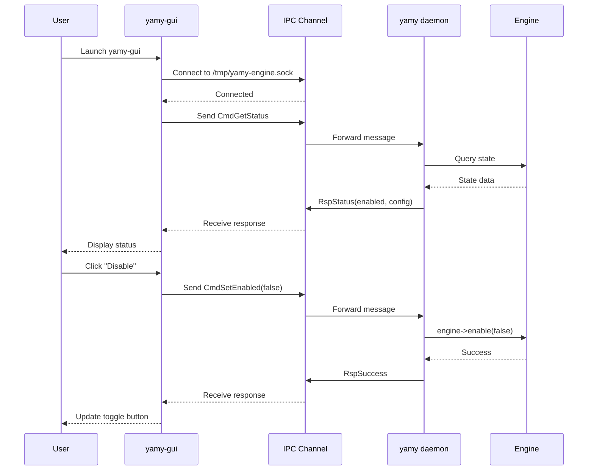

# Design Document

## Overview

The YAMY GUI Application (`yamy-gui`) is a standalone Qt-based desktop application that provides a graphical control panel for the headless yamy daemon. The design adopts a client-server architecture where:

- **yamy daemon**: Runs headless (no QApplication) as background process handling keyboard remapping
- **yamy-gui**: Separate Qt application that connects to daemon via IPC for monitoring and control
- **yamy-ctl**: Existing CLI tool for command-line control (unchanged)

This architecture completely eliminates the Qt/DBus system tray crash by avoiding system tray icons entirely. The GUI uses Qt5 widgets without platform-specific integrations that trigger DBus marshalling bugs.

## Steering Document Alignment

### Technical Standards (tech.md)

The design follows established YAMY patterns:
- Qt5-based UI using existing widget components
- IPC communication via IPCChannelQt (QLocalSocket)
- ConfigManager singleton for configuration access
- Settings persistence via QSettings
- Logging integration with existing Logger infrastructure

### Project Structure (structure.md)

Implementation follows YAMY's modular organization:
```
src/app/
  ├── main.cpp          # yamy daemon (headless, no GUI)
  └── main_gui.cpp      # yamy-gui application (NEW)

src/ui/qt/
  ├── dialog_*.cpp/.h   # Existing dialogs (reused as-is)
  ├── main_window_gui.cpp/.h  # NEW: Main control panel window
  └── ipc_*.cpp/.h      # IPC communication wrappers
```

## Code Reuse Analysis

### Existing Components to Leverage

- **DialogLogQt**: Log viewer dialog with filtering - reused without modification
- **DialogInvestigateQt**: Window investigation tool - reused without modification
- **DialogSettingsQt**: Settings configuration dialog - reused without modification
- **DialogAboutQt**: About dialog - reused without modification
- **NotificationHistoryDialog**: Notification history viewer - reused without modification
- **PreferencesDialog**: Application preferences - reused without modification
- **ConfigManagerDialog**: Configuration management - reused without modification
- **IPCChannelQt**: IPC client implementation - extended for GUI-specific commands
- **ConfigManager**: Singleton configuration manager - accessed via IPC queries
- **Logger**: Logging infrastructure - used for GUI-side logging

### Integration Points

- **IPC Protocol**: Extend existing yamy::ipc::Message protocol with GUI-specific commands:
  - `CmdGetStatus`: Query daemon state (enabled/disabled, config name, error state)
  - `CmdSetEnabled`: Enable/disable keyboard remapping
  - `CmdSwitchConfig`: Switch to different configuration
  - `CmdReloadConfig`: Reload current configuration file
  - `RspStatus`: Status response with daemon state
  - `RspError`: Error response with failure details

- **Daemon Communication**: GUI connects to `/tmp/yamy-engine.sock` using IPCChannelQt
- **Settings Storage**: Qt settings stored in `~/.config/yamy/yamy-gui.conf`
- **Session Management**: Desktop entry `yamy-gui.desktop` for launcher integration

## Architecture

### High-Level Architecture

```mermaid
graph TB
    subgraph User Space
        User[User]
        GUI[yamy-gui<br/>Qt Application]
        CLI[yamy-ctl<br/>CLI Tool]
    end

    subgraph Daemon
        Daemon[yamy<br/>Headless Daemon]
        Engine[Engine<br/>Core Logic]
        IPC[IPC Server<br/>QLocalServer]
    end

    subgraph System
        Input[/dev/input/*<br/>Keyboard Events]
        uinput[/dev/uinput<br/>Virtual Device]
    end

    User -->|Launch| GUI
    User -->|Command| CLI

    GUI -->|IPC Commands| IPC
    CLI -->|Socket Commands| IPC

    IPC -->|Control| Engine
    Engine -->|Read| Input
    Engine -->|Inject| uinput

    GUI -.->|Display Status| User
    CLI -.->|Output| User
```

### Component Interaction Flow



### Modular Design Principles

- **Single File Responsibility**:
  - `main_window_gui.cpp`: Main window UI and layout only
  - `ipc_client_gui.cpp`: IPC communication abstraction only
  - Existing dialogs remain unchanged

- **Component Isolation**:
  - IPC layer completely isolated from UI components
  - UI components communicate only via signals/slots
  - No direct Engine dependencies in GUI code

- **Service Layer Separation**:
  - IPC client acts as service layer for GUI
  - Configuration access via IPC queries (not direct ConfigManager calls)
  - State management centralized in main window controller

## Components and Interfaces

### Component 1: MainWindowGUI

- **Purpose:** Primary window providing status display and control buttons
- **File:** `src/ui/qt/main_window_gui.cpp`, `src/ui/qt/main_window_gui.h`
- **Interfaces:**
  - `MainWindowGUI(QWidget* parent)`: Constructor
  - `void connectToDaemon()`: Establish IPC connection
  - `void refreshStatus()`: Request status update from daemon
  - **Slots:**
    - `void onToggleEnabled()`: Handle enable/disable button
    - `void onSwitchConfig(int index)`: Handle configuration switch
    - `void onReloadConfig()`: Handle reload button
    - `void onShowLog()`: Launch log viewer dialog
    - `void onShowInvestigate()`: Launch investigate dialog
    - `void onShowSettings()`: Launch settings dialog
    - `void onShowPreferences()`: Launch preferences dialog
    - `void onShowNotificationHistory()`: Launch notification history
    - `void onShowAbout()`: Launch about dialog
  - **Signals:**
    - `void statusChanged(bool enabled, QString configName)`
    - `void connectionLost()`

- **Dependencies:** IPCClientGUI, Qt5::Widgets
- **Reuses:** All existing dialog classes (DialogLogQt, DialogInvestigateQt, etc.)

### Component 2: IPCClientGUI

- **Purpose:** High-level IPC wrapper providing GUI-specific communication methods
- **File:** `src/ui/qt/ipc_client_gui.cpp`, `src/ui/qt/ipc_client_gui.h`
- **Interfaces:**
  - `IPCClientGUI(QObject* parent)`: Constructor
  - `bool connectToDaemon()`: Connect to daemon IPC socket
  - `void sendGetStatus()`: Request daemon status
  - `void sendSetEnabled(bool enabled)`: Enable/disable remapping
  - `void sendSwitchConfig(const QString& configPath)`: Switch configuration
  - `void sendReloadConfig()`: Reload current configuration
  - **Signals:**
    - `void connected()`: IPC connection established
    - `void disconnected()`: IPC connection lost
    - `void statusReceived(bool enabled, QString configName, QString error)`
    - `void commandSuccess()`: Command executed successfully
    - `void commandError(QString message)`: Command failed

- **Dependencies:** IPCChannelQt, yamy::ipc::Message
- **Reuses:** IPCChannelQt for low-level socket communication

### Component 3: Daemon IPC Server Extensions

- **Purpose:** Add GUI-specific command handlers to existing IPC server
- **File:** `src/core/platform/linux/ipc_control_server.cpp` (modifications)
- **New Handlers:**
  - `handleGetStatus()`: Return current daemon state
  - `handleSetEnabled(bool enabled)`: Enable/disable engine
  - `handleSwitchConfig(QString path)`: Switch configuration
  - `handleReloadConfig()`: Reload current config

- **Dependencies:** Engine, ConfigManager
- **Reuses:** Existing IPC message protocol and serialization

### Component 4: Headless Daemon Executable

- **Purpose:** Run yamy daemon without QApplication to avoid Qt platform plugins
- **File:** `src/app/main.cpp` (refactored)
- **Changes:**
  - Remove QApplication instantiation
  - Remove system tray icon code (SystemTrayAppIndicator)
  - Keep Engine initialization (no Qt dependency)
  - Keep IPC server for communication
  - Use QCoreApplication for Qt event loop (minimal Qt dependency)

- **Dependencies:** Engine, IPCControlServer, QCoreApplication
- **Reuses:** Existing Engine and IPC infrastructure

## Data Models

### DaemonStatus Model

```cpp
struct DaemonStatus {
    bool connected;          // IPC connection status
    bool enabled;            // Keyboard remapping enabled/disabled
    QString configName;      // Active configuration name
    QString configPath;      // Active configuration path
    QString errorMessage;    // Last error (if any)
    QDateTime lastUpdate;    // Timestamp of last status update
};
```

### IPCCommand Model

```cpp
enum class IPCCommandType {
    GetStatus,
    SetEnabled,
    SwitchConfig,
    ReloadConfig,
    QueryKeymap  // For investigate window
};

struct IPCCommand {
    IPCCommandType type;
    QVariantMap parameters;  // Command-specific params
};
```

### IPCResponse Model

```cpp
enum class IPCResponseType {
    Status,
    Success,
    Error
};

struct IPCResponse {
    IPCResponseType type;
    QVariantMap data;        // Response payload
    QString errorMessage;    // Error description (if type == Error)
};
```

## Error Handling

### Error Scenarios

1. **Daemon Not Running**
   - **Handling:** IPCClientGUI::connectToDaemon() returns false after retry attempts
   - **User Impact:** Main window displays "Daemon not running" message with instructions:
     ```
     YAMY daemon is not running

     Start daemon with: yamy &
     Or enable autostart in system settings
     ```

2. **IPC Connection Lost During Operation**
   - **Handling:** IPCChannelQt emits disconnected() signal, IPCClientGUI relays to GUI
   - **User Impact:** Status bar shows "Connection Lost" in red, all controls disabled with tooltip:
     ```
     Connection to daemon lost
     Click here to reconnect
     ```

3. **Configuration File Syntax Error on Reload**
   - **Handling:** Daemon's parser returns error, sent via RspError message
   - **User Impact:** Error dialog displays parser error details:
     ```
     Failed to reload configuration

     Syntax error at line 42:
     Invalid keymap definition

     Please fix configuration file and retry.
     ```

4. **Invalid Configuration Path on Switch**
   - **Handling:** Daemon validates path existence before switching, returns error if invalid
   - **User Impact:** Notification shows:
     ```
     Configuration file not found:
     /path/to/nonexistent.mayu
     ```

5. **Permission Denied on IPC Socket**
   - **Handling:** QLocalSocket::connectToServer() fails with permission error
   - **User Impact:** Error message:
     ```
     Permission denied accessing daemon socket

     Check that yamy daemon is running as same user
     Socket: /tmp/yamy-engine.sock
     ```

## Testing Strategy

### Unit Testing

- **IPCClientGUI Tests**: Mock IPCChannelQt to verify command generation and response handling
- **MainWindowGUI Tests**: Mock IPCClientGUI to test UI state transitions
- **IPC Message Tests**: Verify serialization/deserialization of GUI-specific commands
- **Error Handling Tests**: Simulate connection failures, invalid responses, timeout scenarios

### Integration Testing

- **GUI-Daemon Communication**: Start real daemon, send commands from GUI, verify state changes
- **Configuration Switching**: Test full flow of switching configs and verifying engine state
- **Reconnection Logic**: Kill daemon during operation, restart it, verify GUI reconnects
- **Multi-Instance Prevention**: Launch multiple yamy-gui instances, verify proper socket sharing

### End-to-End Testing

- **User Workflow: Enable/Disable**: Launch GUI, toggle remapping, verify keyboard behavior changes
- **User Workflow: Config Switch**: Switch between test configs, verify different key mappings active
- **User Workflow: Investigate Window**: Open investigate, select window, verify correct keymap shown
- **User Workflow: Log Viewing**: Generate log events, view in log dialog, verify filtering works

## Build System Integration

### CMake Configuration

Add new executable target:

```cmake
# yamy-gui executable
add_executable(yamy-gui
    src/app/main_gui.cpp
    src/ui/qt/main_window_gui.cpp
    src/ui/qt/ipc_client_gui.cpp
)

target_link_libraries(yamy-gui
    yamy_qt_gui    # Existing Qt UI library (dialogs)
    Qt5::Widgets
    Qt5::Network
)

install(TARGETS yamy-gui DESTINATION bin)
```

### Desktop Entry

Install launcher file:

```desktop
[Desktop Entry]
Type=Application
Name=YAMY Control Panel
Comment=Keyboard remapping control panel
Exec=yamy-gui
Icon=yamy
Categories=Utility;Settings;
Terminal=false
StartupNotify=true
```

## Migration Plan

### Phase 1: Create yamy-gui Executable

1. Create `main_gui.cpp` with QApplication and MainWindowGUI
2. Create `main_window_gui.cpp/h` with basic UI layout
3. Create `ipc_client_gui.cpp/h` with IPC wrapper
4. Build and verify GUI launches and shows "Not Connected" state

### Phase 2: Extend IPC Protocol

1. Add GUI-specific message types to `ipc_defs.h`
2. Implement command handlers in `ipc_control_server.cpp`
3. Implement message sending in `ipc_client_gui.cpp`
4. Test IPC communication with mock responses

### Phase 3: Integrate Existing Dialogs

1. Add menu actions in MainWindowGUI for each dialog
2. Implement slots that instantiate and show existing dialogs
3. Verify all dialogs work correctly when launched from yamy-gui
4. Test dialog-to-daemon communication (investigate window → keymap query)

### Phase 4: Refactor Daemon to Headless

1. Modify `main.cpp` to use QCoreApplication instead of QApplication
2. Remove all SystemTrayAppIndicator code
3. Remove Qt GUI event loop dependencies
4. Test daemon runs without GUI/platform plugins loaded

### Phase 5: Testing and Polish

1. Add error handling for all IPC scenarios
2. Implement auto-reconnection logic
3. Add status indicators and tooltips
4. Write automated tests
5. Update documentation

This phased approach allows incremental development with testable milestones at each step.
