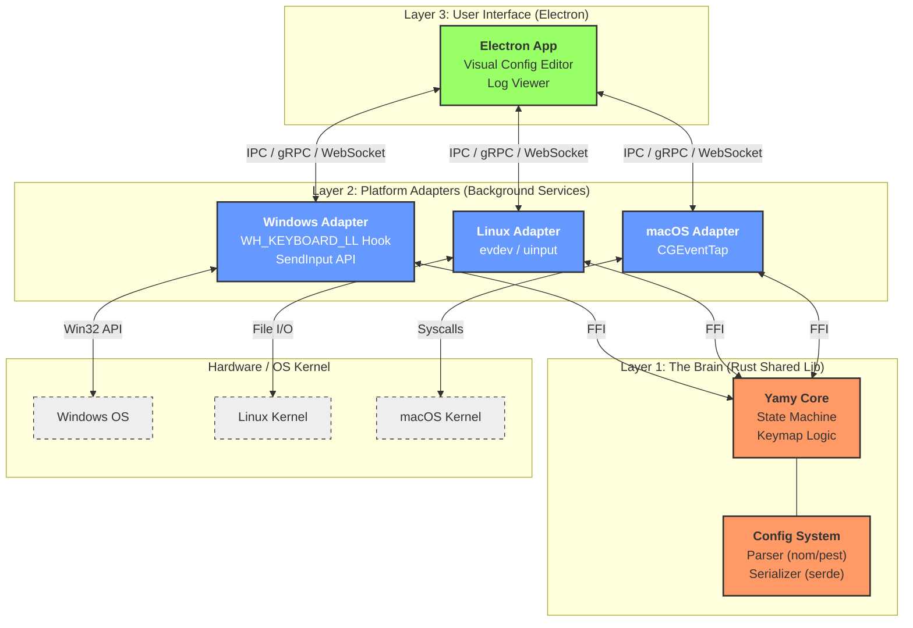
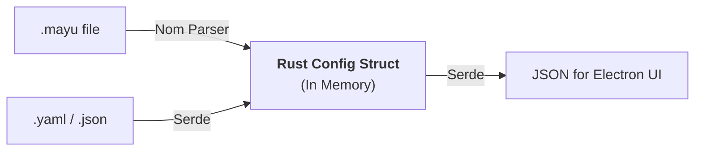

# Future Architecture Proposal: "Yamy Modernization"

This document outlines a proposed architecture to modernize Yamy, moving from a monolithic Windows-specific C++ application to a multi-platform, layered architecture.

## 1. High-Level Architecture

The system is divided into three distinct layers to maximize code reuse while acknowledging OS differences.

### The 3 Layers
1.  **Layer 1: The Core (The "Brain")**
    *   **Language:** Rust.
    *   **Role:** Pure logic. It manages the state machine, parses configuration files (`.mayu`, `.json`, `.yaml`), and processes abstract input events. It knows nothing about Windows `HWND` or Linux `file descriptors`.
2.  **Layer 2: Platform Adapters (The "Limbs")**
    *   **Language:** Rust (mostly) + OS-specific APIs.
    *   **Role:** Translates OS-specific signals into abstract events for the Core, and executes the Core's abstract commands back into the OS.
    *   **Windows Strategy:** Uses `WH_KEYBOARD_LL` (User Mode Hook) to avoid driver signing costs while retaining remapping capabilities.
3.  **Layer 3: User Interface (The "Face")**
    *   **Technology:** **Electron** (Cross-platform).
    *   **Role:** Settings configuration, visual keymap editor, log viewing, and controlling the background service.

## 2. System Architecture Diagram



## 3. Configuration Strategy: "Hybrid & Modern"

We will support both the legacy DSL and modern standard formats.

### A. The Parser (Legacy Support)
We will implement a robust parser for the `.mayu` format using **Rust** (via `nom` or `pest` libraries).
*   **Why:** This allows existing users to keep their config files.
*   **Improvement:** The new parser will provide detailed error messages (e.g., "Syntax error at line 10: Expected key name").

### B. The Serializer (Modern Support)
The Rust Core will define the configuration in strict structs. By deriving `Serialize`/`Deserialize`, we automatically support:
*   **JSON / YAML / TOML:** For power users who prefer standard formats.
*   **GUI Generation:** The Electron UI can read the current config as JSON, render a visual editor, and write it back as JSON or YAML.



### C. Handling Complexity: "Configuration as Code" (Rhai)
For power users (like the author of `config.nodoka`) who rely on complex chains (e.g., `109.mayu` -> substitution -> modifier assignment), static YAML is insufficient. The legacy `.mayu` parser is ad-hoc and fragile.

We recommend **Rhai** (an embedded scripting language for Rust) as the "Ultimate DSL".

*   **Why Rhai?**
    *   **Rust-Native:** Built for Rust, zero friction integration.
    *   **Safe:** Sandbox environment; cannot harm the OS.
    *   **Familiar:** Syntax resembles C/JS/Rust.
    *   **Powerful:** Supports functions, loops, and modules.

**Example (Hypothetical Rhai Script):**
```rust
// 1. Import Physical Layout
import "layouts/109" as hardware;

// 2. Define Helper Function
fn swap_keys(k1, k2) {
    base.remap(k1, Action::Key(k2));
    base.remap(k2, Action::Key(k1));
}

// 3. Define Layers
let base = Layer::new("Base");
swap_keys(hardware.A, hardware.B);

// 4. Conditional Logic
if system.is_app_active("notepad.exe") {
    base.remap(hardware.Enter, Action::Key(hardware.Tab));
}
```

### D. Unlimited Custom Modifiers (Mod0-ModN)
You asked about expanding custom modifiers (currently Mod0-Mod19). The Rust Core architecture removes the hardcoded limit.

*   **New Limit:** You can define up to **255 custom modifiers**.
*   **Platform Support:**
    *   **Windows/Linux:** Fully supported. These are "Virtual Modifiers" tracked by the Engine's state machine. They don't need to exist as real keys in the OS.
    *   **macOS:** Supported internally by Yamy. However, mapping them to *physical* OS modifiers (like `kCGEventFlagMaskCommand`) is limited by the OS. But within Yamy's logic, you can use as many as you want for layers.

## 4. Why Electron for UI?

*   **One Codebase:** Write once (HTML/CSS/JS), run on Windows, Linux, and macOS.
*   **Rich Ecosystem:** Use React, Vue, or Svelte to build complex visual keymap editors (e.g., a graphical keyboard view where you click keys to remap them).
*   **Communication:** Electron communicates with the Rust Background Service via IPC (if bundled) or Localhost (WebSocket/gRPC).

## 5. Windows Hook Strategy (WH_KEYBOARD_LL)

### What happens to `mayud.sys`?
In this modern architecture, **we stop using the kernel driver (`mayud.sys`) entirely.**

*   **Why:** Updating a kernel driver requires an Extended Validation (EV) Certificate (expensive) and strict Microsoft signing (complex). It is a major barrier to entry.
*   **Replacement:** We use **`WH_KEYBOARD_LL` (User Mode Hook)**.

### How `WH_KEYBOARD_LL` works
1.  **Setup:** The Rust Adapter calls `SetWindowsHookEx` to register a callback.
2.  **Intercept:** When a key is pressed, Windows pauses the event and calls our Rust function.
3.  **Decision:**
    *   If we want to **remap**: We return `1` (block the key) and call `SendInput` to inject the *new* key.
    *   If we want to **pass through**: We return `CallNextHookEx` to let the key proceed normally.

*   **Benefits:**
    *   **Zero Cost:** No certificates needed.
    *   **Stability:** If Yamy crashes, your keyboard just reverts to normal (no Blue Screen).
    *   **Compatibility:** Works on Windows 10/11 out of the box.
*   **Limitations:** Cannot override very low-level system sequences (Ctrl+Alt+Del), but sufficient for 99% of key remapping needs.

## 6. Testing Strategy

A keyboard remapper is critical infrastructure; if it breaks, the user cannot type. We need a multi-layered testing approach.

### A. Unit Tests (The Core)
Since the Core is a pure Rust library, we can test the logic without a real keyboard or OS.
*   **Virtual Input/Output:** We can simulate sequences.
    ```rust
    // Test: Does Ctrl+A map to Home?
    let mut engine = Engine::new(config);
    engine.inject(Event::KeyDown(Key::Ctrl));
    engine.inject(Event::KeyDown(Key::A));
    assert_eq!(engine.pop_output(), Action::Key(Key::Home));
    ```
*   **Fuzz Testing:** Pump millions of random key sequences into the engine to ensure it never panics or gets stuck in an infinite loop.

### B. Integration Tests (The Adapters)
To test if the Windows/Linux adapters work, we can use **Virtual Machines** or **Containerized CI**.
*   **Linux:** Using `uinput`, we can create a virtual keyboard device in a Docker container, press keys programmatically, and verify the output events.
*   **Windows:** We can write a test harness that sends `SendInput` events and verifies them with a separate `WH_KEYBOARD_LL` hook, confirming Yamy intercepted and modified them correctly.

### C. Snapshot Testing (Configuration)
To ensure we don't break legacy `.mayu` files:
*   **Parser Tests:** Maintain a repository of 100+ existing `.mayu` files. The test suite parses all of them and compares the resulting Abstract Syntax Tree (AST) against a "golden" snapshot. If a code change alters how a file is parsed, the test fails.

## 7. Migration Steps Summary

1.  **Extract Logic:** Rewrite `src/core/engine.cpp` in Rust.
2.  **Config System:** Implement the `.mayu` parser and JSON serialization in Rust.
3.  **Windows Adapter:** Build a Rust binary that uses `WH_KEYBOARD_LL`.
4.  **Electron UI:** Build a modern frontend to visualize and edit the configuration.
